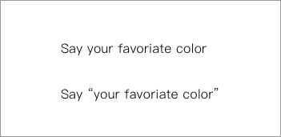
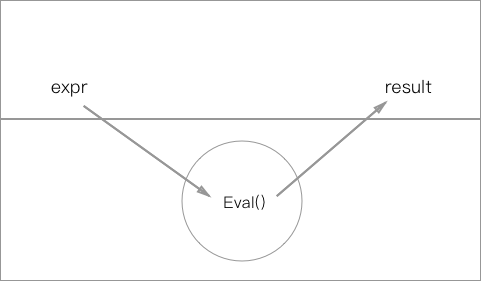
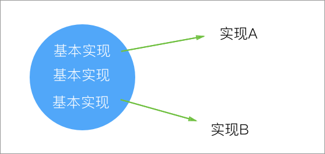
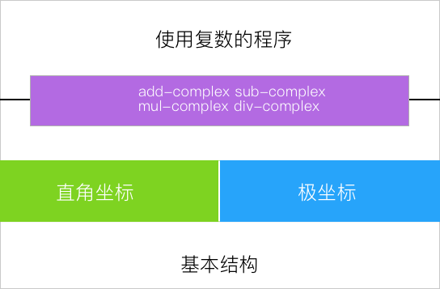
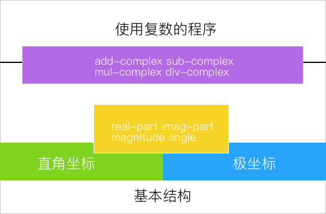
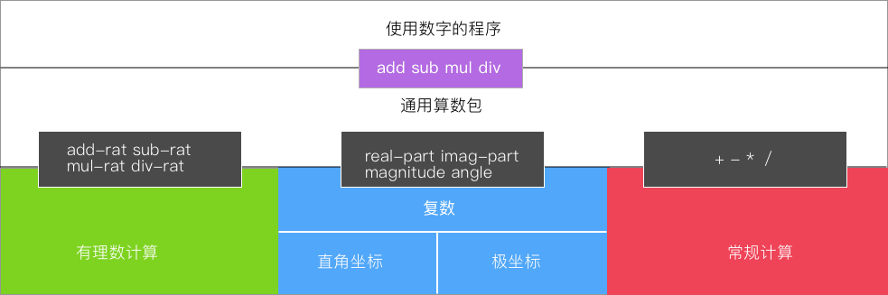
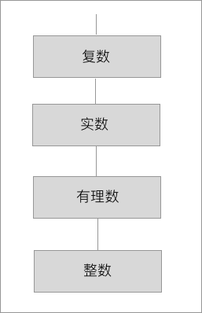

## 符号数据

有过CPP，Java等 OO 语言编程经验的人，肯定对基本类型和各种封箱的引用类型的区别有很大的感触。符号数据是什么，在这里的开始，我们可以先粗浅得把他理解成对象的引用，当然 Scheme 中的符号数据和这个还是有很大的区别的，理解这个符号我们可以先举一个这个例子：



两句话就能看明白 `Symbol` 和 `Value` 的区别，第一句话让我们说我们最喜欢的颜色，第二句是说“你最喜欢的颜色”。自然语言中能区分**词语本身**和**词语的含义**的不同，Scheme 中也有类似的机制。

### 表示符号数据

在 Scheme 的解释器中，我们之前已经了解到了，解释器就是一个不断接收数据的 `eval()` 循环：



每当我们输入表达式，就会接到表达式的返回值。同时我们还知道了，块级作用域的的实现本身是通过层层的 Map 来实现的，那我们只需要一个过程从对应的作用域表里面取出对应名字的引用就可以实现符号数据了。在 Sheme 中我们通常会使用 `'` 符号代表这个值是一个符号类型而非基本类型：

``` lisp
> (define A 10)
> A
> ; Value: 10 使用的是基础类型
> 'A
> ; Value: a 使用的符号类型
```

但是直观上来看这个引号似乎破坏了 Scheme 中的语法，如果为了 `'`  在解释器里单独实现一套机制难免得不偿失，而且是一种给解释器开洞的行为。但实际上在 Scheme 中这个问题被很轻松的解决了，`'` 本身实际上是 `(quote x)` 的一种语法糖。

> Tips : **eq?** 和 **equal?** 和 **symbol?**
>
> * eq? 判断是不是一个引用
> * equal? 判断字面是否相等
> * symbol? 判断元素是不是符号

### 符号求导

书中讨论了简化版的求导函数，导函数完全由乘积和求和合成：

$$
\frac{dc}{dx} = 0 \\
\frac{dx}{dx} = 1\\
\frac{d(u+v)}{dx} = \frac{du}{dx} + \frac{dv}{dx} \\
\frac{d(uv)}{dx} = u(\frac{dv}{dx}) + v(\frac{du}{dx})
$$

从以上的几条表达式来看，后两个表达式的定义形成了递归，所以在实际上求导就会将整个的表达式进行逐步的拆分，一只拆分到最简形式，然后就可以靠前面的两条分别进行规约。

我们先写出为了实现符号求导，我们都需要哪些辅助的函数：


| function               | usage      |
| ---------------------- | ---------- |
| (variable? e)          | 判断 e 是不是变量 |
| (same-variable? v1 v2) | 判断是否是相同变量  |
| (sum? e)               | e 是一个求和式？  |
| (addend e)             | 被加数        |
| (augend e)             | 加数         |
| (make-sum a1 a2)       | 构建和式       |
| (product? e)           | e 是一个乘式？   |
| (multiplier e)         | 被乘数        |
| (multiplicand e)       | 乘数         |
| (make-product m1 m2)   | 构建乘式       |

之前我们有了符号表示的方法，符号表达式也可以很方便的构建出来：

``` lisp
(define (variable? x) (symbol? x))

(define (same-variable? v1 v2)
  (and (variable? v1) (variable? v2) (eq? v1 v2)))

(define (make-sum a1 a2) (list '+ a1 a2))

(define (make-product m1 m2) (list '* m1 m2))
; 通过 list 绑定在一起

(define (sum? x) 
  (and (pair? x) (eq? (car x) '+))) 

(define (addend s) (cadr s))
(define (augend s) (caddr s))
```

有了上面的这些辅助的 API 我们可以来尝试写一下符号求导的过程：

``` lisp
(define (deriv exp var) 
  (cond ((number? exp) 0)                     ; 两种基础条件
        ((variable? exp)
        	(if (same-variable? exp var) 1 0))
        ((sum? exp)							  ; 构建和式 分别求导
        	(make-sum (deriv (addend exp) var)
        				(deriv (augend exp) var))) 
    	((product? exp)                       ; 构建乘式 分别求导
        	(make-sum (make-product (multiplier exp) 
                                    (deriv (multiplicand exp) var))
        				(make-product (deriv (multiplier exp) var) 
                                      (multiplicand exp))))
        (else (error "unknown expression type -- DERIV" exp))))
```

> Tips : 最后写出来的程序和原表达式实在是别无二致
>
> 但是这里面的求导也是有问题的，比如说求出来的导数其实是没有进行化简和约分的。这时候我们就需要修改我们的程序了。但是这时候就体现出我们实现抽象屏蔽的优势了，我们可以通过只改 `make-sum` 和 `make-product` 函数来控制约分的过程。
>
> ``` lisp
> (define (make-sum a1 a2)
>   (cond ((=number? a1 0) a2)
>     	((=number? a2 0) a1) ; 处理 0 乘积
>     	......)
>   
> (define (make-product a1 a2)
>   (cond ((or (=number? m1 0) (=number? m2 0)) 0) ; 处理参数 0 和 1 
>     	((=number? m1 1) m2)
>     	((=number? m2 1) m1)
>     	......))
> ```

### 集合

抽象数据当然也能形成集合，一个集合就是一些不同对象的汇集。形成集合需要满足 `union-set` , `intersection-set`

 `element-of-set?` , `adjoin-set` 等操作。当然从另一个角度上来说，集合的实现也可以多种多样的，只要实现以上的操作的数据结构，我们都可以将它看作一个集合。实际实现方式的选择有很大灵活性，可以基于实际需要考虑，可以用任何合理、有效、易编程的方式表示集合。


#### 未排序的表

``` lisp
(define (element-of-set? x set)       ; 判断元素是否在集合中
  (cond ((null? set) false)
		((equal? x (car set)) true)
		(else (element-of-set? x (cdr set)))))

(define (adjoin-set x set)            ; 元素添加进集合
  (if (element-of-set? x set) 
      set 
      (cons x set)))

(define (intersection-set set1 set2)  ; 求交集
  (cond ((or (null? set1) (null? set2)) '())
        ((element-of-set? (car set1) set2)
          	(cons (car set1) (intersection-set (cdr set1) set2)))
        (else (intersection-set (cdr set1) set2))))
```

直接选用表结构来实现集合非常的简单，但是效率可能就有一些缺憾，判断成员时需要扫描整个表，是$ O(n) $ 操作;加入元素需判断存在性，$O(n)$求交集是 $ O(n*m) $ 操作。

#### 排序的表

我们可以使用已经排序的表来缓解效率上的问题，我们先假定所有的元素都可以进行排序。我们可以采取升序的方式存储数据，这样子在查找的时候边界情况就可以帮我们减少很多的遍历负担，平均的时间复杂度下降到 $ O(n/2) $ 的水平：

``` lisp
(define (element-of-set? x set) 
  (cond ((null? set) false)
		((= x (car set)) true)
		((< x (car set)) false)
		(else (element-of-set? x (cdr set)))))
```

而且求交集的操作也有了很大的便利，我们可以通过比较最小元素的方式进行判断，如果相等就加入并集，不相等就丢弃较小的数继续比较（有点归并排序的意思）：

``` lisp
(define (intersection-set set1 set2) 
  (if (or (null? set1) (null? set2))
	'()
    (let ((x1 (car set1)) (x2 (car set2)))
    (cond ((= x1 x2)
    (cons x1 (intersection-set (cdr set1) (cdr set2))))
    ((< x1 x2) (intersection-set (cdr set1) set2)) 
    ((< x2 x1) (intersection-set set1 (cdr set2)))))))
```

这样子操作的代价就从 $ O(nm) $ 下降到了 $ O(m+n) $ 的程度了。

> 书中还讨论了符号表示的二叉树和霍夫曼树的形式，这里就不赘述了。

## 数据的多重表示

在之前的几节之中我们见过有理数的表示方法，我们通过建立抽象屏蔽的方式，构建了我们的有理数系统，能够数据分层实现，并且提供了未来拓展功能的可能性，可以使程序中的大部分描述与数据对象的具体表示无关。

> Tips 实现数据抽象的方法：
>
> * 用构造函数和选择函数构筑起抽象屏障
> * 在屏障之外只通过这组基本操作使用数据抽象
> * 大任务可以被分解为一系列的小任务

我们在系统中没有办法让一个事物或者数据有标准通用的表示方式。因为就像我们实现的那个抽象屏蔽方式，各层中对数据的形式要是不同的，而且数据对象可以有多种合理的表示形式，系统可能同时都需要使用，那我们就要实现对数据的多重表示。当然我们可以去实现各种数据之间的相互的转换关系，使用的时候判断然后进行数据类型的转换。但是是用这种方式，数据在系统中会进行特别多次的转换，效率和使用便利都得不到保证。

就像在应用里我们可能会和其他人进行合作，我们要让我们的 API 别人使用的时候也能得到便利而不需要对数据进行修改（这对我们的程序部分也有影响），而使用了数据抽象就能同时存在同一类数据的多种不同表示，并很好地支持不同表示的数据之间的相互操作。



### 复数的表示

这里我们使用 `复数` 作为我们的研究对象，复数有多种的表示方法，可以通过 `实部` 和 `虚部` 描述一个复数（直角坐标系方式），还可以通过 `模` 和 `幅角` 进行描述（极坐标方式），两种方式各有千秋，使用第一种方式的程序对加减法更为友好，后者则对乘除法比较有优势。

根据我们在有理数那节的经验，我们可是仿照的画出复数系统的结构图：



我们可以写出这样的定义代码去定义复数的程序：

``` lisp
(define (add-complex z1 z2)
	(make-from-real-imag (+ (real-part z1) (real-part z2))
					     (+ (imag-part z1) (imag-part z2))))
(define (sub-complex z1 z2)
	(make-from-real-imag (- (real-part z1) (real-part z2))
						 (- (imag-part z1) (imag-part z2))))
(define (mul-complex z1 z2)
	(make-from-mag-ang (* (magnitude z1) (magnitude z2))
					   (+ (angle z1) (angle z2))))
(define (div-complex z1 z2)
	(make-from-mag-ang (/ (magnitude z1) (magnitude z2))
					   (- (angle z1) (angle z2))))
```

上面的复数调用程序很简单的，但是为了实现这个复数包的程序我们需要实现的复数包程序就要做一下考虑了，因为在这四个 API 之下，我们可是有两种下层实现的。我们有了可选择的方向，我们无论是倚重哪一种表现形式，都只会对自己这方的 API 有利（毕竟存储成自己所需要的形式，自己这方的 API 就只需要做提取操作就可以了），对另一方的 API 就需要使用转换了。

我们可以从直角坐标的角度去定义复数包的方法：

``` lisp
(define (real-part z) (car z))

(define (imag-part z) (cdr z))

; 做相应的转换 实部和虚部 => 模和幅角
(define (magnitude z)
  	(sqrt (+ (square (real-part z)) (square (imag-part z)))))
(define (angle z) (atan (imag-part z) (real-part z)))

(define (make-from-real-imag x y) (cons x y))

(define (make-from-mag-ang r a) (cons (* r (cos a)) (* r (sin a))))
```

也可以从极坐标的角度去定义复数包的方法：

``` lisp
;  做相应的转换 模和幅角 => 实部和虚部
(define (real-part z) (* (magnitude z) (cos (angle z))))
(define (imag-part z) (* (magnitude z) (sin (angle z))))

(define (magnitude z) (car z))

(define (angle z) (cdr z))

(define (make-from-real-imag x y)
	(cons (sqrt (+ (square x) (square y)))
		  (atan y x)))
(define (make-from-mag-ang r a) (cons r a))
```

到这里我们拥有了有关复数包底层的两种实现，通过直角坐标的定义版本，还有极坐标定义的版本，我们可以自由的替换我们底层的方法。

> Tips : 最小允诺原则
>
> 复数的例子和有理数的例子有很多的相似之处，不过最大的不同，也是这里数据驱动的要点，我们的低层实现有两种形式，并且可以相互转换。
>
> 透过这种抽象屏蔽，我们对实际计算方法的选择和实现都可以延后。我们称之为“最小允诺原则”。

### 给数据加上 Tag

上一节我们对复数的实现的两种方式，都做出了详细的定义，并且通过设计的`最小允诺原则` ,我们可以在上层实现之后再决定选择哪种实现方式，但是这里我们就有了另一个问题，我们可能会希望这两种实现都在系统中出现，并且在有需要的时候进行实时的替换。上一节我们明显没办法直接的作出这样的效果，但是在这一节里我们会通过给不同实现增加 Tag 的方式进行实现。

我们可以给不同的实现类型的数据加上 Tag 让系统能知道复数的实现类型，以便于选择正确的 API 对其进行处理。

我们可以简单定义如下过程：

``` lisp
; 加标签
(define (attach-tag type-tag contents) (cons type-tag contents))
; 返回标签
(define (type-tag datum)
	(if (pair? datum) (car datum)
    (error "Bad tagged datum -- TYPE-TAG" datum)))
; 返回数据内容
(define (contents datum)
	(if (pair? datum) (cdr datum)
	(error "Bad tagged datum -- CONTENTS" datum)))
; 判断谓词
(define (rectangular? z) (eq? (type-tag z) 'rectangular))
(define (polar? z) (eq? (type-tag z) 'polar))
```

然后我们有了这些判断方法之后就可以分别定义两种不同的 API 实现了，书中为了共存对方法名使用了不同的定义，直角坐标系的 API 添加了 rectangular 的尾缀，极坐标系的 API 添加了 polar 的尾缀。然后再具体实现中对类型进行判断再进行分别处理。

> Tips  作者在这里不厌其烦的列举了所有改过名字的 API 我再没看完之前都以为作者。。。了

这里我们只列举修改过的上层 API 大家就应该都明白什么意思了：

``` lisp
(define (real-part z)
	(cond ((rectangular? z) (real-part-rectangular (contents z)))
		  ((polar? z) (real-part-polar (contents z)))
		  (else (error "Unknown type -- REAL-PART" z))))

(define (imag-part z)
	(cond ((rectangular? z) (imag-part-rectangular (contents z)))
		  ((polar? z) (imag-part-polar (contents z)))
		  (else (error "Unknown type -- IMAG-PART" z))))

(define (magnitude z)
	(cond ((rectangular? z) (magnitude-rectangular (contents z)))
		  ((polar? z) (magnitude-polar (contents z)))
		  (else (error "Unknown type -- MAGNITUDE" z))))

(define (angle z)
	(cond ((rectangular? z) (angle-rectangular (contents z)))
		  ((polar? z) (angle-polar (contents z)))
		  (else (error "Unknown type -- ANGLE" z))))
```

我们现在的程序变成了这样，公用的转换部分连接了两种实现：



### 数据导向与可加性

> Tips 基于类型指派的系统设计：
>
> 我们在以上的系统中使用的方法，可以被称作 `基于系统指派的系统设计` 。我们定义了具体方法，给出分别不同的实现，然后通过 Tag 进行区分选择对应的方法。但是这种方法也有自己的劣势：
>
> 1. 系统设计是建立在已知系统透明的状态下进行的，我们要对系统中已知的类型一清二楚。
> 2. 命名通过 API 的命名进行区分，无可避免的可能会出现 API 撞名字的情况出现。

#### 可加性

根据之前的讨论，我们可以说以上的设计其实是不具有可加性。所谓的可加性指的是系统的扩充能力。再现有的系统中增加新的 API 是否方便。从现在的情况来看，这明显不方便。我们可以假设我们还有第三种表示方式需要插入，那我们该如何进行呢：

1. 我们会再写一遍这些所有的 API 特殊实现（这是正常的）
2. 然后每个实现的名字都要跟上方法的后缀（烦）
3. 在对四个实现增加 `cond` 语句的操作（超烦）

这里面我们能看到，尤其后两点简直让人无法忍受，实现方法后缀还要能记得住，对实现增加 `cond` 的分支，这里只有4个 API 还好说，但是多了的话就很恐怖的了。

> Tips 这里缺乏可加性的原因：
>
> 我们在实际的视线中通过 Tag 和 cond 的方式实现了类型和对应方法之间的绑定，但是如果增加类型就要修改代码。所以我们应该试图通过其他方式建立这两种东西之间的相互联系——数据驱动设计

#### 数据驱动设计

这是在分层的抽象屏障之后我们学到的另一种模块化的系统设计技术。抽象屏障让我们把系统分成了层，数据驱动则使用了不同的思路，我们可以通过数据去选择对应的实现和方法。我们先将对应的实现和方法分门别类的去存起来，然后使用接收到的数据去判断和查找我们需要的过程，再使用这些过程去处理数据。因此这种方式被称作数据驱动设计。

我们可以用一个表格去表示我们系统所需要的 API：

| 操作／类型      | Polar           | Rectangular            |
| ---------- | --------------- | ---------------------- |
| real-part  | real-part-polar | real-part-rectangular  |
| image-part | imag-part-polar | image-part-rectangular |
| magnitude  | magnitude-polar | magnitude-rectangular  |
| angle      | angle-polar     | angle-polar            |

我们可以用类似这样的一个数据结构去存储我们所需要的 API，使用类型当作第一个维度，操作当作第二个维度进行搜索我们所需要的过程，这样子系统的扩充就不再是一件困难的事情了，我们只需要向这个表格增加一列而已。

我们可以假定有这样的 API 进行存储和搜索工作：

``` lisp
; 操作／类型 ／过程
(put <op> <type> <item>)
; 操作／类型
(get <op> <type>)
```

> Tips 根据这个 API 可以试试把这个结构想像成一个哈希表

既然选择了使用这种方式去构建，我们对两方面的实现就有了一些要求：

* 两种实现要有同性，能够无缝调用，系统不需要知道具体的实现过程
* 各种实现方法都要有对应的过程实现（可以名称相同了），还要有把数据绑定到表格里的过程

直角坐标系：

``` lisp
(define (install-rectangular-package)
; internal procedures
	(define (real-part z) (car z))
	(define (imag-part z) (cdr z))
	(define (make-from-real-imag x y) (cons x y))
	(define (magnitude z)
			(sqrt (+ (square (real-part z)) (square (imag-part z)))))
	(define (angle z) (atan (imag-part z) (real-part z)))
	(define (make-from-mag-ang r a) (cons (* r (cos a)) (* r (sin a))))

; interface to the rest of the system
	(define (tag x) (attach-tag 'rectangular x))

	(put 'real-part '(rectangular) real-part)
	(put 'imag-part '(rectangular) imag-part)
	(put 'magnitude '(rectangular) magnitude)
	(put 'angle '(rectangular) angle)
	(put 'make-from-real-imag 'rectangular
		(lambda (x y) (tag (make-from-real-imag x y))))
	(put 'make-from-mag-ang 'rectangular
		(lambda (r a) (tag (make-from-mag-ang r a))))
'done)
```

我们定义了和之前一样的方法，使用了一个无参函数把对应的方法安装到这个表格之中。

极坐标包也有类似的东西：

``` lisp
(define (install-polar-package)
    ;; internal procedures
    (define (magnitude z) (car z))
    (define (angle z) (cdr z))
    (define (make-from-mag-ang r a) (cons r a))
    (define (real-part z) (* (magnitude z) (cos (angle z))))
    (define (imag-part z) (* (magnitude z) (sin (angle z))))
    (define (make-from-real-imag x y)
    	(cons (sqrt (+ (square x) (square y))) (atan y x)) )
    ;; interface to the rest of the system
    (define (tag x) (attach-tag 'polar x))
    (put 'real-part '(polar) real-part)
    (put 'imag-part '(polar) imag-part)
    (put 'magnitude '(polar) magnitude)
    (put 'angle '(polar) angle)
    (put 'make-from-real-imag 'polar
      	(lambda (x y) (tag (make-from-real-imag x y))))
    (put 'make-from-mag-ang 'polar
    	(lambda (r a) (tag (make-from-mag-ang r a))))
'done)
```

在我们把两类处理数据的过程都安装到表格里之后，我们就可以使用方法来进行搜索和调用了：

``` lisp
(define (apply-generic op . args) ; . 之后的参数是不定参数
  	(let ((type-tags (map type-tag args))) ; 求出 args 的 类型
         (let ((proc (get op type-tags)))  ; 找对应过程
              (if proc
                  (apply proc (map contents args)) ; 应用对应过程
                  (error
                   	"No method for these types -- APPLY--Generic"
                   	(list op type-tags))))))
```

这样子 `复数包` 的 API 就有了无需替换的实现：

``` lisp
(define (real-part z) (apply-generic 'real-part z))
(define (imag-part z) (apply-generic 'imag-part z))
(define (magnitude z) (apply-generic 'magnitude z))
(define (angle z) (apply-generic 'angle z))
```

即使再有新的 API 加入对应的表格我们的 `复数包` 的 API 也是这些，方法的选择完全依赖数据的类型，这就是数据驱动设计的好处。

#### 消息传递

我们也可以把对象作为一个实体，让实体去接收消息以便于去掉用所需操作的过程。这就是 SmallTalk 中最早的消息传递的 OOP 设计思路。 Scheme 的消息传递设计使用了一个过程表示对象，将对对象的对应操作放在了过程内部。所以说`消息传递` 也被称作 `dynamic dispatching` 或者叫动态分配的技术。

> Tips OOP?
>
> 谈起 OOP 我们能想到很多东西，在不同的时候我们也会被问到各种和 OOP 有关系的东西。熟悉Java 和 Cpp 的人会说OOP 就是类、想谈 OOP 设计的人可能会说 抽象、封装、继承、多态。但是消息传递作为 OOP 的特性之一我们也要记住。
>
> 还有就是谈 OOP 的时候我们应该确定不同的语义下 OOP 的不同意思。比如 SmallTalk 的 OOP 和 CPP 的 OOP 就有很大区别。

我们可以这么来实现一个生成负数的程序：

``` lisp
(define (make-from-real-imag x y)
	(lambda (op)
	(cond ((eq? op 'real-part) x)
		  ((eq? op 'imag-part) y)
		  ((eq? op 'magnitude) (sqrt (+ (square x) (square y))))
		  ((eq? op 'angle) (atan y x))
	(else
		  (error "Unknown op--MAKE-FROM-REAL-IMAG" op)))))
```

看到这个表达式我们就能很清楚的了解到底什么叫 `dynamic dispatching` 了，复数的数据不再使用 `con` 的方法结成 list 而是通过一个方法进行存储，方法对传入的参数进行处理返回对应的部分。

我们也要修改 `apply-generic` 过程的具体实现：

``` lisp
(define (apply-generic op args) (args op))
```

这个实现简直是太简单明了了，我们接收对应的 `op` 和 `arg` ，再把 `op` 传给 `args` 去调用不同的部分。这样每个对象都是一个能够表示状态的 `dispatching` 过程。

>Tips 这个用过程存储对象的实现其实似曾相识，我们在上一章中就是用过 lambda 表示 `con` 函数。

## 带有通用型操作的系统
在复数包的实现中我们实现了 `直角坐标` 和 `极坐标` 表示方法的统一，我们通过数据驱动的方式动态的去选择我们所需要的方法去对数字进行处理，但是这还是不够，我们的系统可能还想要更高层次的抽象，将有理数、复数、和常规运算三种系统合而为一，让我们的外部 API 只有 `add sub mul div` 这几个函数就好了，这样子整个数字系统的结构图如下所示：


### 实现通用的算数运算

``` lisp
(define (add x y) (apply-generic 'add x y))
(define (sub x y) (apply-generic 'sub x y))
(define (mul x y) (apply-generic 'mul x y))
(define (div x y) (apply-generic 'div x y))
```

这里的技术和上一节的东西没区别，都是数据驱动。我们只需要增加常规计算的 API 进入方法表就可以了。

``` lisp
(define (install-scheme-number-package)
	(define (tag x) (attach-tag 'scheme-number x))
	(put 'add '(scheme-number scheme-number)
		(lambda (x y) (tag (+ x y))))
	(put 'sub '(scheme-number scheme-number)
		(lambda (x y) (tag (- x y))))
	(put 'mul '(scheme-number scheme-number)
		(lambda (x y) (tag (* x y))))
	(put 'div '(scheme-number scheme-number)
		(lambda (x y) (tag (/ x y))))
	(put 'make 'scheme-number (lambda (x) (tag x)))
'done)

(define (make-scheme-number n)
	((get 'make 'scheme-number) n))
```

我们可以给 Scheme 支持的常规数字面量增加相应的 Tag 和对应的方法。通过这样的方法增加，常规计算就和 `复数` 、`有理数` 一样可以进入这个系统中正常的操作了。复数和有理数的实现和安装方式和之前的没有区别就不赘述了。

使用双层 Tag 表示的方法最后会结成一个这样的结构：


首先我们知道这是一个复数，而且知道这是一个用直角坐标表示的，那么我们就可以把这个数字解析成 $ 3 + 4i $ 。

### 系统的分层结构和跨越

虽然一切似乎都有一种解决了的感觉的，但是我们还有一个非常重要的问题没有去处理。我们目前的系统、系统的 API 的各个部分似乎被拼装到一起了，但是它们实际上还是分开的，复数包的 API 还是只能计算复数之间的运算、常规运算也只能处理常规运算。目前我们并没有实现一种办法去打通各个部分的方式，而且我们的跨类型操作至少需要保证类型隔离不被破坏。

> Tips 数据类型的跨越
>
> 在分层系统中我们会经常需要对数据进行不同的转型操作，可能会向上转型增加标签，也可能向下转型剥离标签。

**一种不合理的尝试** ：

``` lisp
(define (add-complex-to-schemenum z x)
	(make-from-real-imag (+ (real-part z) x)
						(imag-part z)))
(put 'add '(complex scheme-number)
	(lambda (z x) (tag (add-complex-to-schemenum z x))))
```

这种通过增加 API 的方法是一种非常不推荐和不合理的尝试，如果每个类型之间的联通都靠增加 API 来实现会造成出 $ O(n^2) $ 个方法出来，简直恐怖。

#### 层次类型

对于本身有明显线形的类型转换系统，我们可以用构建 `类型塔` 这种东西去实现，类型在塔中的向上和向下的类型转换。



每一个更小的数域的数据都可以被更大的数域的数字所概括，所以这时候我们就只需要进行强制向上转型就好了。比如常规 Scheme 数可以看成虚部为 0 的复数，它们与复数之间的运算可以转化为复数运算。如：

``` lisp
(define (scheme-number->complex n)
	(make-complex-from-real-imag (contents n) 0))
; 到一个特殊的强制表（使用 put-coercion 和 get-coercion）：
(put-coercion 'scheme-number 'complex
	scheme-number->complex)
```

但是明显有一些类型是不能转化的，比如向下转型就会丢失数据，这样我们就可以不写这些函数（当然如果我们有时候会需要利用这些丢失数据的方法）。

> Tips 类型塔
>
>  我们在初学 C 语言的时候就已经接触过 类型塔这种东西了 int => float => double 这种东西的实现本质上就是向上转型。另外 Java 中的基本类型的 int to float 数据转换实际上是用过 JNI 层的函数去完成的，使用 `union` 进行数据类型转换这也算是一个技巧吧。

相应的我们还需要对 `apply-generic` 过程做一些修改：

``` lisp
(define (apply-generic op . args)
  (let ((type-tags (map type-tag args)))
       (let ((proc (get op type-tag)))
            (if proc
                (apply proc (map contents args))
                (if (= (length args) 2)
                    (let (type1 (car type-tags)) ; type 1
                         (type2 (cadr type-tags)); type 2
                         (a1 (car args))  ; number 1
                         (a2 (cadr args))); number 2
                    (let ((t1->t2 (get-coercion type1 type2))
                          (t2->t1 (get-coercion type2 type1))) ; 两种转换方式 一定存在一个
                         (cond (t1->t2
                                (apply-generic op (t1->t2 a1) a2)) ; 转换后再进行运算操作
                           	   (t2-t1
                                (apply-generic op a1 (t2->t1 a2)))
                           	   (else 
                                (error "No method for these types"
                                       (list op type-tags))))))
                (error "No method for these types"
                       (list op type-tags))))))
```

这种通过 `强制` 的交互操作，我们只需要沿着一条直线进行类型转换就行了，两种类型之间只需要实现一个转换就可以了。运算时将低类型对象逐步强制，直至两对象类型相同，在返回结果时也可以相应的类型下降，下降到无法再下降就可以了（C 中没有类型降解的过程）。

#### 塔式结构的不足

我们对塔式结构的了解和讨论已经足够充分了。但是有的时候我们未免还是太过乐观的了，在实际的使用中，不是所有的东西显示模型都能转成这种类型塔的样子。有更多的情况下，各个类型都可以有可能有各种不同的耦合结构，不会这么的直上直下：


就如同图中的这个多边形的例子，我们可能有一个模型具备多种的性质，没有办法进行直上直下的类型塔转化。

> Tips 符号代数
>
> 书中在这里有一个 `符号代数` 例子，可以参照学习。从中我们可以发现数据导向的程序技术完全能处理任意复杂的递归结构的数据对象，只要一直递归下去就好了。

## 总结

在这一节中我们学到了很多和数据抽象的知识。在上一章使用过程抽象创建了抽象屏蔽之后，我们能通过数据抽象将实现的选择延迟到使用的时候再进行，结合层次屏蔽一起我们能构建更简洁更健壮的系统。另外我们还见识到了 Scheme 对符号数据计算的支持，这样我们显示定义的符号求导、符号计算成为了可能。在下一章中我们会进一步的看到模块化、求值相关的内容。