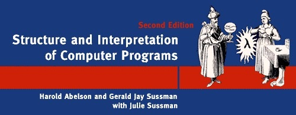
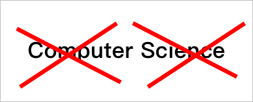
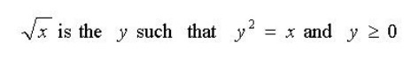
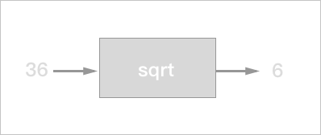
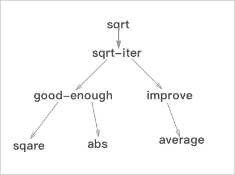
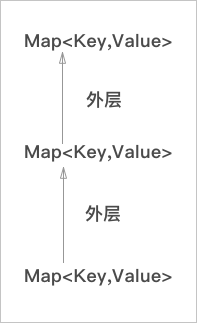

---
title: 0x00：SICP 的魔法 - Scheme 基础和黑盒抽象
date: 2017-02-21 22:22:14
tags: SICP
---

> 作者 ：[刘丰恺](https:;github.com/lfkdsk)
>
> 作者博客：[若梦浮生](https:;lfkdsk.github.io/)
>
> 转载需征得作者本人同意

计算机科学的内容包罗万象，其中的经典的课程也是不胜枚举。但是在这其中SICP(Structure and Interpretation of Computer Programs)绝对是其中的经典和翘楚，在2008年以前SICP的MIT6.001课程历来是CS相关专业必修入门课程。

SICP的核心内容是什么呢？众说纷云，有人说是一本有关Lisp／Scheme的书主要讲函数式编程的思想，有的说是一本有关解释器构造的入门书籍，和我们学过的龙书挂钩，但就我个人而言，SICP作为一本入门书更多的不是担负起介绍某一方面具体的知识的重任，而是从多个角度去教一个初学者从程序抽象、理解工程架构、学习DSL的构建方法......，不单纯介绍一方面的知识而是完备的形成一个闭环的去像你介绍什么是Computer Science。相比于这些当初选用`MIT Scheme`现在使用`Python`，不过是最大程度上减小编程语言本身的复杂度对学生理解的影响，个人觉得无足挂怀。

SICP的各个版本的封面，都选择了魔法师作为其中的主要素材，这里也作为我这个系列的名字，让我们一起领略SICP的魔法。

## 学习之前

在正式开始之前，我们先简单的了解几个问题。

### 我们如何看待Computer Science？



很惊人对吧，第一次看到这个`NO COMPUTER NO SCIENCE`的时候我也是被这种说法吓到了。但是对于这个说法的讲解倒也是能自圆其说。

首先是`NO SCIENCE`，作者在课上说CS不像是一门科学更像是一门艺术或者是工程。工程好理解，但是艺术听起来就很玄之又玄的感觉，但是这里笔者想谈谈自己的感受，对于笔者个人而言，编程像是一种写作，就想写作当前这篇文章的感觉是一样的，代码／文字从手中流淌出来，形成程序／文章，两者可以说是近乎相同的。

再说这个`NO COMPUTER`，作者认为这门学科也不是完全和计算机有关，就像几何学不一定合圆规和量角器有关系一样，文以载道，计算机只是帮助我们实现这些功能的工具而已，这也就是为什么变成会被称作和魔法相同，编写代码／编写咒语，即使我们生活在一个没有计算机的魔法世界，我们仍然能学习这门课程（当然不会再被称之为CS了）。

###  定义和过程的理解



我们首先来看这个公式，这是一个对于平方根的`定义`，和我们在数学书上学到的一样。给我们一个y的值我们可以很方便的确定是不是x的平方根，但是这个公式并不能告诉我们平方根到底是怎么求的，也就是说上文只是在告诉我们平方根到底是什么。

但是如果要涉及怎么求平方根，我们就需要借助牛顿迭代法了，通过猜测一个数字，再根据求出商，两者相加求平均值作为下一次的平方根猜测量，这样逐步逼近到达一个最接近的数值就是x的平方根。

> 如下求 2 的平方根


| 猜测量    | 商                   | 平均值                             |
| ------ | ------------------- | ------------------------------- |
| 1      | 2/1 = 2             | (2 + 1) / 2 =  1.5              |
| 1.5    | 2 / 1.5 = 1.3333    | (1.5 + 1.3333) / 2 = 1.4167     |
| 1.4167 | 2 / 1.4167 = 1.4118 | (1.4167 + 1.4118 ) / 2 = 1.4142 |
| 1.4142 | ...                 |                                 |

这个使用牛顿迭代法的步骤就可以称作为是`过程`，因为它解决了我们如何求解平方根这个问题，告诉了我们怎么做。

## Scheme 基础

之前我们说过，选择 Scheme 看重的是它的函数性特性，但是更重要的是它的简洁易用能减少学习语言的负担。 Scheme 是一门解释器语言，其实也有编译器的实现，不过这都不重要。解释器语言是一个接受输入返回数据的大循环(Read-Evaluate-Print Loop)，就像是聊天的交互一样，每接受一段输入，就返回这段代码的执行结果，这就是书封面图的由来：


​							**(一个Eval和Apply互生的球)**

### 构造语言的三个基本要素

* 基本表达式形式：构造各种程序的基础
* 组合机制：简单的表达式构造更复杂的表达式
* 抽象机制：为复杂的结构命名，通过简单方式使用

这三者的意义都好理解，但是在这里还要针对 Scheme 的语法特性去分别理解，暂且按下不表。

### 语言处理的两种要素

除此之外程序设计包含两类处理要素：

* 过程
* 数据

这两者我们也都熟悉，在我们学过的大部分静态语言中如：`C`(这个越来越难举例子了，Cpp／Java都有自己的函数式实现)中，过程就是代码程序，数据呢就是我们定义的变量，两者楚河汉界、泾渭分明。

但是在 Scheme 中就像那个太极图一样，过程和数据的界限越来越模糊，**数据可作为被执行的代码，代码可作为被处理的数据**。

### 简单的语法知识

这里介绍一些简单的语法知识用来学习更多的相关知识。

#### 表达式

在 Scheme 中 表达式中最基本的表达式就是一个数字：

``` lisp
> 486 ; 输入
486
```

简单的表达式，使用前缀的形式，括号里第一个元素表示操作（运算），后面是参数（运算对象）运算符和参数之间、不同参数之间用空格分隔：

``` lisp
> (+ 34 5)
39
> (* 3 4)
12
```

#### 组合子

表达式可以进行嵌套和组合：

``` lisp
> (+ 1 (* 3 4))
13
```

**注意使用合理的代码书写规范 **

#### 命名和环境

对变量和过程进行命名：

``` lisp
> (define size 15) ; 定义变量
size
> (define (getSize x) ; 定义过程
    	(* x 3))
getSize
> (getSize 12)
36
```

小标题里面提到了环境(environment)这个意义可能需要介绍一下，其实这个环境和作用域和可见性都是相关的概念，你可以理解为程序有一个全局的`Map`存储了很多的键值对，Key是名字，Value是数据还是过程都可以。除此以外，程序的每一层`block`（代码块）都有一个自己的`Map`存储当前环境下的键值对，这个存储的`Map`就可以简单理解为当前的环境。

> Tips: 与C语言对比：
>
> * C里面没有明显的环境定义，但是从变量的可见性／覆盖／上能看出环境。
> * C中的表达式在当前环境中求值，语句可能修改当前环境中有效定义的变量（Scheme的区别之后会详解）。
> * C中有明确的类型系统，Scheme 连数据和过程都模糊了，这个自然也不会有。

### 小结

使用上面三个小节的简单的 Lisp 知识，我们几乎就可以开始编写代码了，虽然我们还没有介绍分枝结构，循环结构，上面的三个小节已经覆盖了构成一个语言的三要素：

- 基本表达式形式：构造各种程序的基础                            *** / + -**
- 组合机制：简单的表达式构造更复杂的表达式                **( )**
- 抽象机制：为复杂的结构命名，通过简单方式使用        **define**

## 黑箱

> Tips: 其余有用的简单语法知识
>
> * 条件表达式
>
> ``` lisp
> ; 类似switch语法结构的cond子句
> (define (abs x)
>   (cond ((> x 0) x)
>     	((= x 0) x)
>     	((< x 0) -x)))
> ; if子句
> (define (abs x)
>   (if (< x 0)
>       (-x)
>       x))
> ```
> * 复合谓词
>
> ``` lisp
> ; and 
> (and expr1 expr2...)
> ; or 
> (or expr1 expr2...)
> ; not
> (not expr1)
> ```

### 再看平方根

之前我们提到了用牛顿迭代法求平方根的过程，整个过程就像是这样的一个黑箱一样，我们不需要知道`过程`实现的细节，就可以直接使用：



再从分解的角度上看结合我们在第一节里面的讨论，再加上我们已经学过了一些 Scheme 的内容，我们能得出这样的计算平方根的代码：

```lisp
(define (sqrt-iter guess x)
	(if (good-enough? guess x)
		guess
		(sqrt-iter (improve guess x)
					x)))
```

​        求值的过程，被分解成了几个子函数来计算，`good-enough?`是一个判断对精度的判断，`improve`是求平均值，总而言之，略去这些函数的定义，这个算法其实相当的轻便和易懂。

​	算法的分解图如下：



这也是黑箱的另一种角度，从结构可以看到，不但过程是用户的黑箱，过程和过程之间也是存在着护卫黑箱的关系的，比如`sqare`是`good-enough`的黑箱，`good-enough`又是`sqrt-iter`的黑箱。

所以这里我们能得到这样的结论：

* **应该把被用的过程看作黑箱，关注功能，不关注其实现**
* **过程抽象的本质是一种功能分解，各个子过程之间也互为黑箱**

### 过程抽象的实现手段

* 局部名：

``` lisp
(define (square x) (* x x))
(define (square y) (* y y))
```

这东西其实很好理解，上面的两个定义本身不因形参名字的改变而改变，x是这个过程的`约束比变量`，可以理解为作用域逃不出当层环境，只是一个`占位符`。

这其中如果`自由变量`（类比可见性强的变量）和`约束变量`名同就会被约束变量替换，该环境下拿到的变量就是当前环境x，而非全局的x了。

* 内部定义和块结构：

Scheme 支持在过程内定义过程，这其实也很简单，也是一种隐蔽细节的手段，通过内部定义减少全局环境的名字，来避免干扰，可以类比定义类的私有函数。

事实上，`环境`可以使用特别简单的模型去考虑:



层层相连，每层都是键值对，当解释器遇到一个变量的时候，从最内层的环境去找，找到了就返回，没找到就继续向上层找，这也就是为什么会出现变量`捕获`的情况出现。

### 小结

隐蔽细节的黑箱操作能够为组织代码带来很多优势，从中能得出很多启示：

* 控制名字的作用范围，防止不同`环境`之间的名字冲突
* 信息尽可能做到局部化
* 块结构对控制程序的复杂性很有价值

