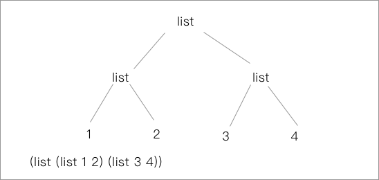
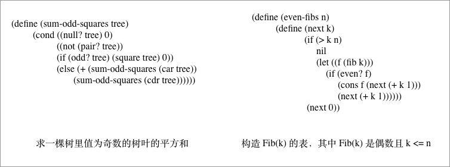
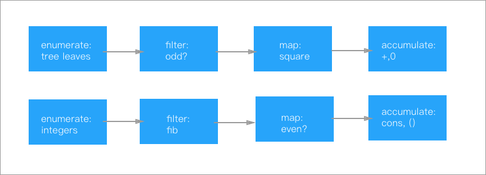
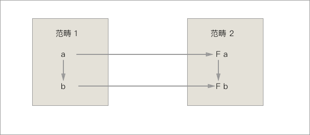
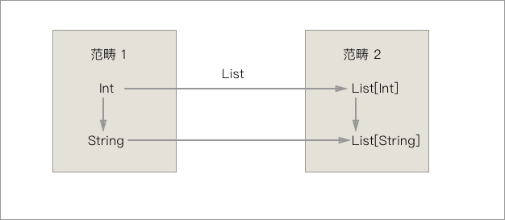
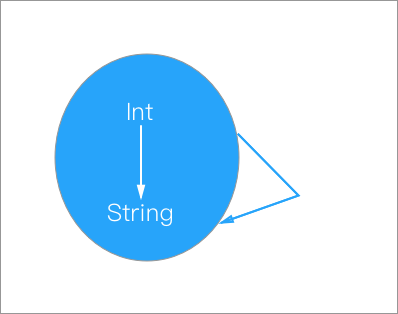

在第一章里面，我们已经见识到了`过程`抽象的魔法，一个过程描述了一系列数据的计算过程，但本身又是一种元素可以出现在程序的任何部分，所以说过程是一种抽象，我们在使用的时候不需要知道任何和具体实现有关的东西，只需要调用我们已经定义好的过程就行了。

与此相类，`数据`本身也可以作为一种抽象，我们在之前接触的数据都是一些简单的数据，所以可能没什么感受。但是数据也可以包含不止一种的信息，使用的时候隐藏具体的实现细节，具体使用的时候又能作为元素出现在程序任意的位置，因此数据也是一种抽象。

> 有过 OO 语言经验的同学 可以借助类的概念理解一下以上的概念
>
> 但是`类`的概念是无法完全概括的哦～

## 数据抽象

我们从最简单的数据抽象开始，首先说最小的数据抽象集合 —— 序对。

### 序对

要实现数据抽象首先要有能把数据打成一个包的方法，我们叫它`构造函数`，还应该有能把数据从捆中取出来的方法，我们叫他`选择函数`。

在 Scheme 中提供了能实现这些方法的 API:

| Function Name | Usage                       |
| ------------- | --------------------------- |
| ( cons p1 p2) | 能把两个参数打包成一个对象               |
| ( car x )     | 能从 `cons` 打包出的对象 取出其中的第一个数据 |
| ( cdr x )     | 能从 `cons` 打包出的对象 取出其中的第二个数据 |

对于能非常方便构建 `class` 或是 `struct` 这样的数据结构的其他语言的使用者来看，这个序对的作用实在是微乎其微，但是大的抽象模式都是从最小的抽象方式开始的，我们这里使用序对也只是为了演示 Scheme 的抽象能力。

### 如何定义有理数？

这看起来似乎不是个问题，因为语言都会原生支持各种类型的浮点数，能轻松的用来表示有理数，但是请先忘了有关这方面的知识，单纯考虑当我们的系统只能支持整形数据的时候我们应该怎么表示有理数。

从上一小节的序对的知识出发，我们很容易找到答案，我们可以把有理数的小数点前后的部分，分别用一个整形数据来表示，再把他们用 `cons` 打包，当进行计算的时候再拆开计算就可以了。

所以我们对于有理数的定义甚至都可以用上面的函数来表示 ：

| Function Name     | Usage       |
| ----------------- | ----------- |
| ( make-rat x y )  | 生成有理数 x.y   |
| ( number bundle ) | 获取 x.y 中的 x |
| ( denom bundle )  | 获取 x.y 中的 y |

写实现也很简单 ：

``` lisp
; 直接打包
(define (make-rat x y) 
  (cons x y))
; 拿第一个数
(define (number bundle) 
  (car bundle))
; 拿第二个数
(define (number bundle)
  (cdr bundle))
```

我们这样就可以用上面的 API 去实现有理数的四则运算什么的 ：

``` lisp
(define (add-rat x y)
	(make-rat (+ (* (numer x) (denom y))
		(* (numer y) (denom x)))
		(* (denom x) (denom y))))
(define (sub-rat x y)
	(make-rat (- (* (numer x) (denom y))
		(* (numer y) (denom x)))
		(* (denom x) (denom y))))
; ... 还有很多
```

这样我们会发现 `add-rat` 、`sub-rat` 这样的函数作为过程抽象，仅接受我们定义的 `有理数` 类型 ( 即 `cons` 包裹的类型 ) 的数据就可以了，我们甚至完全不需要知道有理数到底是什么，只需要把有理数提交给过程，就可以拿到返回的有理数类型的返回结果了。

数据抽象和过程抽象相辅相承，在他们的帮助之下，我们为系统增加了类型，这无疑是一种新的进步，我们可以自己制作类型了。

### 实现抽象屏障

刚才的有理数程序可以体现为这样的一张层次图：　


可以看出来，对于不同层次的程序来讲，有理数的意义都是不同的，对于使用的程序来讲，有理数就是一个普通元素，到了需要表示有理数的层次，有理数被分成了分子分母来使用，到了序对表述的层次，有理数是通过某种系统实现，将两个整形数据绑定在一起的。

实现这样的抽象屏障有什么好处？包括但不限于：

* 不同的部分关联极少，可以独立修改和增添方法。
* 修改实现方便，减少错误的发生。
* 修改方便的话，我们对设计就也有帮助，一些决策可以推迟。

> Tips: 修改实现如何体现方便呢？
>
> 举个例子，如果我们换了实现 `序对` 的 API，那我们也只需要修改最下面一层就可以全部修改。相反，如果我们所有的方法都依赖于 最下层实现，比如如果我们的 `add-rat` 方法里面还是用了 `car` 、`cdr` 这样的方法，那我们如果想彻底改掉这套 API 需要修改下方全部的三层实现。

### 数据的过程实现

我们之前使用的有理数程序，仅靠了三个基本过程去定义，而没有看到具体的实现过程，那么“数据到底是什么呢”？

数据的抽象实现有很多种办法，这里我们挑一种不依赖低层实现，尽在 Scheme 中就能实现的方法，通过过程去实现数据抽象：

``` lisp
; cons 定义
(define (cons x y)
	(define (dispatch m)
		(cond ((= m 0) x)
			  ((= m 1) y)
			  (else (error "Argument error ")))))
; car / cdr 定义
(define (car z) (z 0))
(define (cdr z) (z 1))
```

当然 Scheme 中的数据实现肯定不是这么做的，为了效率很定是通过底层实现的。但是从这个例子里我们可以回顾在本书开头的一句话，过程和数据之间没有绝对界限，这里就看到了过程可以直接表示数据的能力。

> Tips : Church encoding 丘奇计数
>
> 看起来很鬼畜，但是可以通过完全通过 $ \lambda $ 演算去实现全部的整数运算系统。
>
> 比如说像下图一样，我们用 lambda 的层数去表达数字，还可以通过这个来实现运算。
>
> 
>
> Test 2.6 就和这个有关。

## 层次抽象

我们有了序对的具体实现，但也并不是说我们就只能把两个数据捆绑在一起，我们的 Bundle 也可以作为序对的一个元素出现，这样子我们就可以通过层次结构去实现线性结构，我们通常可以把它们描绘成一个盒图的形式：


我们可以说这种特性是一种闭包性质。

> Tips 闭包的含义：
>
> * 书里面的意思应该是说组合数据对象的结果仍能继续组合，这是符合数学含义的意义( list 中的元素在运算下封闭)
> * `Closure` 的另一个含义，是指带有自由变量的过程，`Closure Function` 和普通函数一样拥有作用并且在传递的过程中仍能携带这些自由变元。

### 序列的形成

从上图可以看出，我们的 `Pair` 可以通过结成链的形式形成一个线性的序列，实际上这看起来和我们所知道的线性表的实现如出一辙，通过把 `cons` 过程的层层嵌套我们得到了一个线性表： 

``` lisp
; 通过这样的方式结成链
(cons 1
      (cons 2
            (cons 3
                  (cons nil))))
; 当然我们也可以直接使用 list API
(list 1 2 3)
```

在结成了一个序列之后，我们的过程 `car` 和 `cdr` 都有了新的意义，`car` 可以取出 list 中的第一个元素， 而 `cdr` 返回的是第一个元素以外的剩余元素所形成的列表。

有了数据表，就可以实现很多常见的表操作了，比如：

``` lisp
(define (length items)
  	(if (null? items)
  		0
  		(+ 1 (length (cdr items))))) 
; 求表的长度
(define (append list1 list2)
    (if (null? list1)
        list2
        (cons (car list1) (append (cdr list1) list2))))
; 合并两个数据表
```

> Tips：数据表在现在流行语言中是常见的数据结构，无论是 CPP STL 里面的 list 还是 Java 中的 List 系列的数据结构都是从 Lisp 的表中吸取了很多的特性。

### 高阶操作和层次结构

一些现代的、支持函数式的语言都提供了类似 `map` 、`reduce` 、`filter` 这些高阶函数的支持，都是实现了一种映射的操作。用其中的 `map` 举例子，它的实质是提供了一个对所有元素操作的映射，所得到的序列顺序不变。

比如我们可以写一个对每个元素等比例放大的例子：

``` lisp
(define (scale-list items factor)
    (if (null? items)
        nil
        (cons (* (car items) factor)
              (scale-list (cdr items) factor))))

(scale-list (list 1 2 3 4 5) 10)
(10 20 30 40 50)
```

如果我们将这个过程在提高一层抽象我们就可以得到了 `map` 的定义了：

``` lisp
(define (map proc items)
    (if (null? items)
        nil
        (cons (proc (car items))
        (map proc (cdr items)))))

; 我们可以很方便的用 map 去实现 scale-list
(map lambda(x) (* x 10) (list 1 2 3 4 5))
(10 20 30 40 50)
```

`map` 操作是一个重要的里程碑，这表明了我们可以脱离对序列的具体操作，而专注于对元素的操作上面。映射的层次从元素的等级提升到了表层。

我们可以把本身是元素的节点也替换成 `list` 去推广这个映射方式，那线性的表就变成了立体的树：



树形结构的便利就很有迹可循了，可以自然地用递归方式处理。仍然使用之前对序列的例子（对序列进行等比例放缩），相应的我们可以写出相应的 Scheme 代码：

``` lisp
(define (scale-tree tree factor)
    (cond ((null? tree) nil)
        ((not (pair? tree)) (* tree factor))
        (else (cons (scale-tree (car tree) factor)
            (scale-tree (cdr tree) factor)))))

(scale-tree (list 1 (list 2 (list 3 4) 5) (list 6 7)) 10)
(10 (20 (30 40) 50) (60 70))
```

当然本身这个过程也可以使用 `map` 进行抽象：

``` lisp
(define (scale-tree tree factor)
    (map (lambda (sub-tree)
            (if (pair? sub-tree) 
                (scale-tree sub-tree factor)
                (* sub-tree factor)))
          tree)) 	
```

树本身也可以看做一个序列，我们可以使用 `map` 映射到子树的每一个节点，然后再分别对每一个节点进行处理，有子树的向下继续递归，叶子就翻倍。

### 序列操作

我们先举两个例子：



这两个问题看起来有很大的不同，但是其实两个过程本身都有一些通性：

| 表现／类型 | 枚举        | 累积     | 过滤         | 选出的数操作   |
| ----- | --------- | ------ | ---------- | -------- |
| 求平方和  | 枚举所有的树叶   | 累计求平方和 | 过滤奇数       | 平方和      |
| Fib   | 枚举所有的 Fib | Fib 求和 | 过滤偶数 k <=n | 求 Fib(k) |

可以画成这样的流程图：



上图表现出了一个信息流的传递过程，在程序中表现出这个信息的传递过程，就能让数据操作更为清晰。

> Tips: 链式调用和流式 API
>
> 事实上链式调用和流式 API 在现代的编程中起到很大的作用。无论是 jQuery 还是 Reactive 系的各类 程序库，都使用了这种方式去设计 API。

> Tips: 信息流结构
>
> * 需要注意表示和处理从一个步骤向下一步骤流动的信息
> * 表适合表示和传递这些信息，通过表操作实现各步处理

#### filter

Filter 过滤器的实现思路很简单，递归发现不满足条件的跳过，满足条件的继续，最后重整成一个表。

``` lisp
(define (filter predicate sequence)
    (cond ((null? sequence) nil) ; 不满足的丢掉
          ((predicate (car sequence))
          (cons (car sequence)   ; 满足条件的保留绑定在一起
          		(filter predicate (cdr sequence))))
          (else (filter predicate (cdr sequence))))) 
```

#### accumulate

累加器之前已经有过介绍了，通过传入操作符，递归使用操作符进行计算。

``` lisp
(define (accumulate op initial sequence)
    (if (null? sequence)
        initial
        (op (car sequence)
        	(accumulate op initial (cdr sequence)))))
```

#### enumerate

树和序列的枚举之前都已经出现过了，可以直接使用。

#### 重整序列

重整过的序列操作，就可以通过以上提供的 API 进行整理，我们求一棵树奇数树叶的平方和的过程就可以定义出来了：

``` lisp
(define (sum-odd-squares tree)
    (accumulate +
                0
                (map square
                	(filter odd? (enumerate-tree tree))))) 
```

我们求  `Fib`  的程序中也可以通过改变上面这些序列的顺序去表示：

``` lisp
(define (even-fibs n)
    (accumulate cons
                nil
                (filter even?
                		(map fib (enumerate-interval 0 n))))) 
```

> Tips : flatmap 的过程
>
>  用过使用函数式编程库的人都会很熟悉 flatmap 这个过程，flatmap 被描述为一个映射积累的过程。
>
> ``` lisp
> (define (flatmap proc seq)
>   	(accumulate append nil (map proc seq)))
> ```
>
> 首先对 seq 中的每一个元素映射，然后再把他们累积起来。**Monad 的类型都是实现了 `flatmap` 过程**。下面一节就来解释一下这句话到底是什么意思。

## 理解Monad 

> A monad is just a monoid in the category of endofunctors, what's the problem?

这是一个老梗了，翻译过来应该是说：“一个函子不过就是自函子范畴上的一个幺半群而已，有什么难理解的？”。

那我们理解也应该从这个比较数学的角度去理解 Monad 相关的概念。

### Semigroup

一个 `Group` 是非空的集合 ，针对群上的 二元运算`&`，(group,&) 群支持下面几项性质:
* 封闭性（Closure）：对于任意$ a，b∈G ​$，$有a\text{&}b∈G ​$
* 结合律（Associativity）：对于任意$ a，b，c∈G $，有$（a\text{&}b)\text{&}c = a\text{&}(b\text{&}c）$
* 幺元 （Identity）：存在幺元e，使得对于任意$ a∈G，e\text{&}a=a\text{&}e=a $
* 逆元：对于任意$a∈G$，存在逆元$a^{-1}$，使得$a^{-1}\text{&}a=a\text{&}a{^-1}=e$


除此以外，这几项性质还可以互相组合：

* 如果仅满足封闭性和结合律，则称G是一个半群`Semigroup`。
* 如果仅满足封闭性、结合律并且有幺元，则称G是一个含幺半群`Monoid`。

这个思想如果通过代码来描述出来其实会比较清晰：

``` java
public interface SemiGroup<T> {
    T append(T a, T b);
}

public abstract class Monoid<T> implement SemiGroup<T> {
	protect T identityValue;
}

// String 的 demo
public class StringMonoid extend Monid<String> {
  	protect String identityValue = "";
  	public String append(String a, String b) {
      	return a + b;
  	}
}
```

那我们说`StringMonoid` 就是一个幺半群的实例。你可以从`String` 的理解去理解幺半群这个概念，存在幺元（“” 空字符），存在封闭性（合成的字符串对 String 封闭），存在结合律（`append` 的嵌套使用）。

### Functor

> Tips 范畴 
>
> 范畴论中的范畴概念由三部分组成：
>
> * 对象
> * 态射 
> * 态射组合
>
> 态射就是上图中的 `Int => String` 绑定两个对象，从 `Int` 到 `String` 。
>
> 态射组合是由多个态射组合成的对象


> Tips 范畴公理
>
> * 态射的组合操作要满足结合律
> * 范畴中任何对象存在单位态射（A => A / Int => Int）
> * 态射在复合操作下是闭合的


`Functor` 通常被翻译成`函子`，函子表示着范畴之间的转换关系，我们可以用这样的图来表示：



这里我们假设里面范畴1 里面有两个类型(a 和 b)， $ a => b $ , 范畴2 里面有两种类型（F a 和 F b），$ Fa => Fb $ ，这两个范畴之间还存在着映射，$ a => Fa $ 和 $ b => Fb $ ，我们就称两个范畴之间的映射是**函子(Functor)** 。

我们可以用 `Integer` 和 `String` 之间的关系去更方便的去理解：



这其中 `自函子`  是一类比较特殊的函子，它是一种将范畴映射到自身的函子：



那 `Functor(函子)` 到底做了一件什么事情呢，我们以`functor((Int => String) => (List[Int] => List[String])`函子大概做了这样的三件事：

* 生成出所有元素的态射结果
* 对生成的结果执行 F 变化，生成集合的集合
* 在自然变换下，将集合的集合合并成一个大的集合


### Monad

> A monad is just a monoid in the category of endofunctors

这说明 Monad 作为一个幺半群，它的元素都是自函子。这个范畴的态射既包含元态射，也包含组合态射。

假设我们现在有一个范畴 `Friends` ，list本身是一个 Monad: 

``` java
list = [ "A","B","C","D","E","E"]   
```

这个范畴里的`态射`是`findFriend` 函数：

``` java
AFriendList = A.findFriend()
```

我们做的第一步就是生成了所有元素的态射对象的结果，针对每一个人找寻他们的朋友，获得到了每个人的朋友的集合。

然后全体使用 Functor 映射到另一个范畴上生成集合的集合：

``` java
A => List[A] // 元素全集
AFriendList => List[AFriendList] // 朋友的 list 全集
```

这时候这个 list 的构成是这样的：

``` java
list = [
  [a - friends],
  [b - friends],
  ...
]
```

我们再把这个数组拍成平面的，就获得了最后所求的全部的朋友列表：

``` java
list = [ a-friends, b-friends ,...] 
```

我们会发现这个操作恰恰和我们之前提到的 `flatmap` 操作是相同的，我们把某个操作映射到一个集合里面，然后又把所有的结果形成一个集合返回。所以说**Monad 的类型都实现了 `flatmap` 过程**。

## 小结

这一节里面我们学到了和数据抽象和层次抽象的知识，数据的抽象体现在了形成序列和抽象屏障两方面，层次抽象体现在了在高阶过程的定义和通过序列的操作，最后还真对 `flatmap` 的操作简单的介绍了一些和 Monad (单子)的 知识，下一节我们会看到更为有趣的符号运算和数据的多重表示。