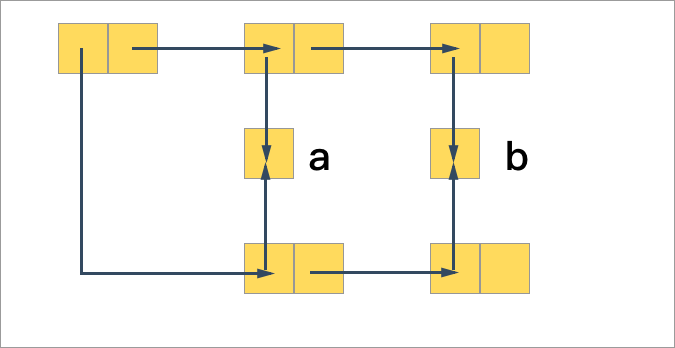
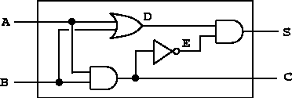
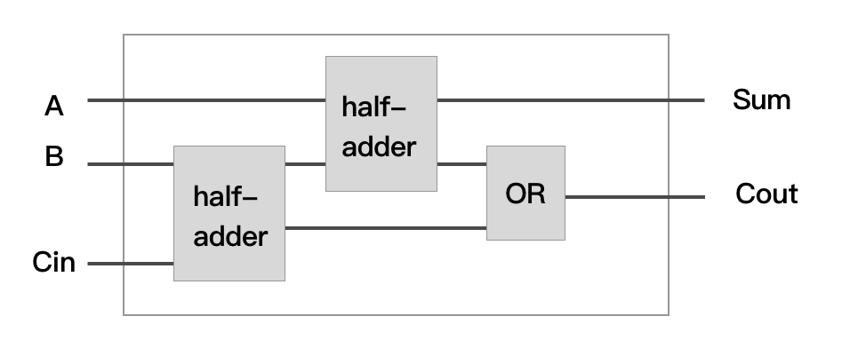
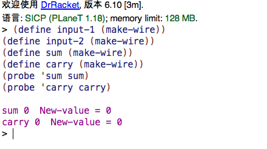
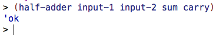
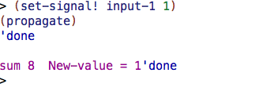
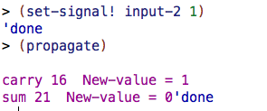

在第二章我们学到的和 **数据抽象** 相关的知识指出，如果想构造数据抽象，我们需要两个部分：

1. 创建构造函数包含数据
2. 创建选择函数 **分派** 数据

但是在经过了解了第三章相关的 *模块化、状态、环境* 的知识之后，我们认识到了新的问题，在实际编程之中，需要依赖程序的状态进行编程，那么程序中就要根据我们的环境求值的方式进行计算，那我们在重新设计和模拟系统大的时候就要多考虑几点了：

3. 在系统中我们带状态的数据抽象
4. 创建 **改变函数(mutator)** 去对数据进行重新修改


## 基于变动的模拟

在构建复杂的系统之中，我们最先面对的部分就是关于 *同一性* 的知识，这部分知识我们已经在上一章的 **同一性发生了变化** 的那个小节中简单的讨论过一次，我们可以在这个再重新讨论一下 **共享和相等** 的知识。

### 共享和相等

我们通过引入赋值的方式为系统引入了状态，但是造成了引用透明的危机，我们没办法再通过相同的结构来判断对象西相同，两个相同结构的对象并不能确定两个对象是否相同：

``` lisp
(define x (list 'a 'b))
(define z1 (cons x x))
```

我们定义了这样的一个结构，*x* 是`'a` 和 `'b` 组成的序对，然后 *z1* 是由两个 *x* 的组成的序对，我们还要在另外定义一个 *z2*：

``` lisp
(define z2 (cons (list 'a 'b) (list 'a 'b)))
```

这两个结构的定义起来，看起来的结构是一样的：



这里我们能看到放置 `'a` 和 `'b` 两个序对中的节点都指向了同一个节点，这是因为在 Scheme 中符号引用是共享的，因而他们都指向了同一个节点。但是很明显虽然 **符号引用** 都指向了同一个节点，但是整体的结构是两个结构指向了两个结构，直接使用：

``` lisp
(eq? z1 z2)
```

的结果肯定是不相等的，这意味着我们每次使用 `cons` 方法结成一个新的序对都是生成了一个新的对象并返回的是可操作该对象的 *指针/引用* （虽然 Scheme 中没有显示的这种概念）。

这时候我们需要考虑另一个问题，就是在整个 *数据抽象* 都是不可变的情况下，我们对于数据结构是否使用了同样的引用是不可知的，但是当我们引入 *赋值* 我们共享的数据因为使用了同一个贡献的结构而变得复杂起来，修改其中的一个会导致另一个收到影响。

比如我们上文中提到的 *z1* 和 *z2* 就是这样结构，z1 的两个子结构全都是 x ，如果我们修改一个另一个肯定会受到影响，但是 z2 序对中的两个元素是两个不同的序对，并不会有这个的问题。

引入共享结构会带来一些好处：

* 扩充数据抽象能够定义的数据范围
* 作为内部状态引入的结构，能够在程序的运行过程中不断地变化，这就可以承担我们需要让他们模拟更为复杂可变的需求

但是上面的这个例子（关于 z1 和 z2 的）也表明了，我们在构建复杂结构的时候需要自己清楚那些结构是共享的，在对这些共享的进行修改的时候我们也要谨慎。

### 以赋值改变结构

> Tips 基于改变函数的新 API，我们的数据依赖 **序对** 进行构造，那我们的改造函数需要和构造函数类似的结构
>
> * `set-car!`  修改序对中的首项
> * `set-cdr!`  修改序对中的第二项


在之前我们使用该通过过程来存储数据和模拟序对的表示，当时我们通过 $0,1$ 作为 Tag 模拟了序对的分派，这里我们可以对这个程序略作修改：

``` lisp
(define (cons x y)
  (define (dispatch m)
    (cond ((eq? m 'car) x)
          ((eq? m 'cdr) y)
          (else (error "Undefined operation -- cons" m))))
  dispatch)

(define (car z) (z 'car))
(define (cdr z) (z 'cdr))
```

这个程序的变化其实不大，我们这是利用了 Scheme 中的符号引用的唯一性的这点，本质上和用 **0 1** 没有什么区别。我们再跟着这个改造的理念可以为这个程序进行扩充，添加我们之前提到的 `set-car!` 和 `set-cdr!` 函数：

``` lisp
(define (cons x y)
  (define (set-x! v) (set! x v))
  (define (set-y! v) (set! y v))
  (define (dispatch m)
    (cond ((eq? m 'car) x)
          ((eq? m 'cdr) y)
          ((eq? m 'set-car!) set-x!)
          ((eq? m 'set-cdr!) set-y!)
          (else (error "Undefined operation -- cons" m))))
  dispatch)

(define (car z) (z 'car))
(define (cdr z) (z 'cdr))
(define (set-car! z new-value) ((z 'set-car!) new-value) z)
(define (set-cdr! z new-value) ((z 'set-cdr!) new-value) z)
```

这里面我们通过增加了程序的内部状态，并且增加了两个内部方法来搞定了这个问题。

接下来部分是几个非常有趣的实例学习，包括对表格，队列和数字电路的模拟。这里面前面的表格、队列的知识都比较的简单，这里我们主要关注这个 *数字电路模拟* 的学习。

## 数字电路模拟

>  本节中的代码可以到 Github 仓库 [**SICP-Magical-Book**](https://github.com/lfkdsk/SICP-Magical-Book) 中获取



这是一个比较有趣的实例，一个数字电路的模拟器本身是完成一种基于状态的系统模拟，而且本身从设计构建系统的角度中来看数字电路的模拟也是非常好玩，因为本身数字电路是由更多的细小的部件来构成的，本身带有一种自底向上进行程序设计的思路。另外，数字电路模拟还包含了另一种思想，一种基于事件驱动的模拟系统，我们用 *事件信号* 模拟实际的 *数字信号* 流过整个模拟的电路程序。

### 事件驱动设计

> **事件驱动程序设计**（英语：**Event-driven programming**）是一种电脑[程序设计](http://www.wikiwand.com/zh-sg/%E7%A8%8B%E5%BC%8F%E8%A8%AD%E8%A8%88)[模型](http://www.wikiwand.com/zh-sg/%E6%A8%A1%E5%9E%8B)。这种模型的程序运行流程是由用户的动作（如[鼠标](http://www.wikiwand.com/zh-sg/%E6%BB%91%E9%BC%A0)的按键，键盘的按键动作）或者是由其他程序的[消息](http://www.wikiwand.com/zh-sg/%E8%A8%8A%E6%81%AF)来决定的。相对于批处理程序设计（batch programming）而言，程序运行的流程是由[程序员](http://www.wikiwand.com/zh-sg/%E7%A8%8B%E5%BC%8F%E8%A8%AD%E8%A8%88%E5%B8%AB)来决定。批量的程序设计在初级程序设计教学课程上是一种方式。然而，事件驱动程序设计这种设计模型是在交互程序（Interactive program）的情况下孕育而生的。
>
> —— Wikipedia

从这段维基百科中摘取出来的关于 *事件驱动程序* 的介绍，我们对事件驱动可能已经有了一定的理解。其实简单的去理解事件驱动设计，其实就是和传统的基于批处理的程序设计不同，因为那么去写过程式的程序，只能根据程序开发者的编写顺序对程序进行运行，但是事件驱动的程序设计，就像是设定了某些条件，当某些事件触发了这些条件的时候，程序会自动对事件进行处理。

这里我们的数字电路的模拟也是类似，一个数字电路由更细粒度的一系列的组件构成，在整个数字电路的操作中，各个部件的活动构成了这个整体的活动。

* 电路系统的构建的过程中会遇到一些事件，这些事件是由某些部件遇到一些情况而引发的，并且引发可能是有时间顺序的（很正常，数字信号的传播肯定有顺序）。
* 还有一个是事件会引起状态的继续改变，状态的改变又会继续带来事件的产生和传播。

### 基础部件

实际的数字电路线路由一些电子元件和它们之间的连线组成，一个电子元件可能有几个输入端口和一个输出端口，功能就是从多个接入信号经过一系列处理然后输出一个信号：


就向我们上图的这些部件，可以提供一些 *与、或、非门* 这些基础部件，另外我们还需要各种部件之间的连线，这些连线会需要传递 *0、1* 这样的信号，除此之外各种功能块都会有不同的输出并且产生删除出信号都会有一些信号延迟。

在不断地通过基本构造块和连线进行数字链路的搭建的过程中，实际的数字电路程序已经实际成了一种结构设计语言，并且通过模块的不断构造我们语言的中使用的基本模块也在不断的在扩充，我们用这种语言能够构造结构任意复杂的数字电路：

* **模块化** —— 基本构造块是基本元素
* **组合机制** —— 通过基本元素和连线进行组合
* **抽象机制** —— 我们可以进一步将复杂的组合过程抽象成过程

### 连线

> Tips 半加器：
>
> 半加器的功能是将两个一位二进制数相加。它具有两个输入和两个输出（分别是和、进位）。输出的进位信号代表了输入两个数相加溢出的高一位数值。因此，这两2个一位二级制数的和等于2*C* + *S*。根据两个一位二进制数相加的结果，可以通过真值表、[卡诺图](https://zh.wikipedia.org/wiki/%E5%8D%A1%E8%AF%BA%E5%9B%BE)得到右图所描绘的简易半加器设计。它使用了一个[异或门](https://zh.wikipedia.org/wiki/%E5%BC%82%E6%88%96%E9%97%A8)来产生和*S*，并使用了一个[与门](https://zh.wikipedia.org/wiki/%E4%B8%8E%E9%97%A8)来产生进位信号*C*。如果再添加一个[或门](https://zh.wikipedia.org/wiki/%E6%88%96%E9%97%A8)来接收低位的进位输出信号，则两个半加器就构成了一个全加器。

电路需要由连线来连接我们的基础功能块，由基础的功能块组成更大的功能块，我们这里先使用一个定义生成基础连线的方法 *(make-wire)* 生成一条连线，我们可以通过这个方法生成连线，然后把各个部件绑定在一起：

``` lisp
; 生成六根连线
(define a (make-wire))
(define b (make-wire))
(define c (make-wire))
(define d (make-wire))
(define e (make-wire))
(define s (make-wire))

; 使用与或非门构建半加器 参考之前的半加器图片
(or-gate a b d)
(and-gate a b c)
(inverter c e)
(and-gate d e s)
```

这里面的 A 和 B 是数据输入，S 和 C 是数据输出，其中S 是和，C 是进位，我们能看到抽象出来连接线、和与、或、非门之后我们对电路的的描述能被抽象到非常简洁形式，我们还可以把这几个过程结合成一个流程生成出一个 半加器的过程：

``` lisp
(define (half-adder a b s c)
  (let ((d (make-wire))
        (e (make-wire)))
    (or-gate a b d)
    (and-gate a b c)
    (inverter c e)
    (and-gate d e s)
    'ok))
```

两个半加器和一个或门能够成一个全加器：



``` lisp
(define (full-adder a b c-in sum c-out)
  (let ((s (make-wire))
        (c1 (make-wire))
        (c2 (make-wire)))
    (half-adder b c-in s c1)
    (half-adder a s sum c2)
    (or-gate c1 c2 c-out)
    'ok))
```

这就是像是我们之前提到的，使用抽象机制将全加器、半加器这些复杂组件封装成构建过程。

我们在这里还可以给出连线上的发送信号的基本操作：

``` lisp
(get-signal <wire>) ; 返回当前线上的信号值
(set-signal! <wire> <new-value>) ; 重设线上的信号值
(add-action! <wire> <procedure of no arguments>) ; 在线上的信号改变的时候运行过程
(after-delay <time> <procedure> ; 设定一个时间延迟和对应的过程，时间过后触发过程
```

这就能试着写出 `make-wire` 的定义，肯定是包含上面三个函数的 dispatch 的 **分发器**，还要有针对多个属性的 **修改器**。

``` lisp
; 创建一条连线
(define (make-wire)
  (let ((signal-value 0)
        (action-procedures '()))
    ; set new value and call procedures
    (define (set-my-signal! new-value)
      (if (not (= signal-value new-value))
          (begin (set! signal-value new-value)
                 (call-each action-procedures))
          'done))
    
    (define (accept-action-procedure! proc)
      (set! action-procedures
            (cons proc action-procedures))
      (proc))
    
    (define (dispatch m)
      (cond ((eq? m 'get-signal) signal-value)
            ((eq? m 'set-signal!) set-my-signal!)
            ((eq? m 'add-action!) accept-action-procedure!)
            (else (error "Unknown operation -- WIRE" m))))
    
    dispatch))
```

我们注意到刚才提到的东西我们几乎都有，并且通过过程 `accept-action-proceduer` 能知道每条线包含的过程不只有一个，是一个列表的形式，而且 `set-my-signal!` 中我们看到，每当有一个线上的数据修改，我们会重新调用所有监听这条线上的过程。

其中还有一些其他的方法：

``` lisp
; 遍历调用
(define (call-each procedures)
  (if (null? procedures)
      'done
      (begin
        ((car procedures))
        (call-each (cdr procedures)))))

(define (get-signal wire)
    (wire 'get-signal))

(define (set-signal! wire new-value)
    ((wire 'set-signal!) new-value))

(define (add-action! wire action-procedure)
    ((wire 'add-action!) action-procedure))
```

执行一些 dispatch 方法而已。

> Tips 书中的一到课后题也提到了，例如：
>
> ``` lisp
>     (define (accept-action-proceduer! proc)
>       (set! action-proceduers
>             (cons proc action-proceduers))
>       (proc))
> ```
>
> 这个方法，为什么要把 proc 在最后返回，其实这里就是为了让 proc 在那个返回的位置展开，在后面会调用 `after-delay` ，`after-delay` 会调用 `add-to-agenda!` ，将指定的动作添加到模拟器的待处理列表中，当调用 `(propagate)` 时，这个指定的动作会被执行。

### 逻辑电路门

``` lisp

; 算数逻辑非
(define (logical-not s)
  (cond ((= s 0) 1)
        ((= s 1) 0)
        (else (error " Invalid signal " s))))

; 算数逻辑与
(define (logical-and a b)
  (if (and (= a 1) (b = 1))
      1
      0))
      

; 逻辑或
(define (logical-or a b)
  (if (or (= a 1) (= b 1))
      1
      0))

; 与门 给两个线路都绑上一个监控器
; 当某个值变化的时候 会重新计算 new-value 设置到输出端口
(define (and-gate a1 a2 output)
  (define (and-action-procedure)
    (let ((new-value
           (logical-and (get-signal a1) (get-signal a2))))
      (after-delay and-gate-delay
                   (lambda ()
                     (set-signal! output new-value)))))
  (add-action! a1 and-action-procedure)
  (add-action! a2 and-action-procedure)
  'ok)

; 或门 
(define (or-gate input-1 input-2 output)
  (define (or-action-procedure)
    (let ((new-value
           (logical-or (get-signal input-1) (get-signal input-2))))
      (after-delay or-gate-delay
                   (lambda ()
                     (set-sign! output new-new-value)))))
    (add-action! input-1 or-action-procedure)
    (add-action! input-2 or-action-procedure)
    'ok)

; 反门
(define (inverter-gate input output)
  (define (invert-input)
    (let ((new-value (logical-not (get-signal input))))
      (after-delay inverter-delay
                   (lambda () (set-signal! output new-value)))))
  (add-action! input invert-input)
  'ok)         
```

如果我们理清了前面的给连线添加信号的内容，那逻辑电路门部分的代码就很简单了，甚至有点冗余。与或非门的唯一区别在于如何生成 `new-value` ，每个过程都包含一个内部过程，负责生成新的值，把这个过程绑定到输入线上，这里面我们的输入值一旦改变，就会重新进行计算，然后重设当前线路中的数值。

### 待处理表

待处理表的问题主要是我们之前在程序中的使用 `after-delay` 操作控制程序在某个时间段之后执行一个过程，能控制一定的操作的时序性，这个功能本质上就是在维护一张 *待处理表* ，使用队列的结构控制我们执行过程，先给出各个 API 的内容：

``` lisp
; 返回新建的空待处理表
(make-agenda) 
; 判断待处理表是否为空
(empty-agenda? <agenda>) 
; 返回待处理表中第一个项
(first-agenda-item <agenda>) 
; 删除待处理表里的第一项
(remove-first-agenda-item! <agenda>) 
; 向待处理表中加入一 项，其意义是要求在给定时间运行的过程
(add-to-agenda! <time> <action> <agenda>) 
; 返回当前时间
(current-time <agenda>) 
```

这些 API 的实现都很容易，我们可以逐个的来讲解一下：

``` lisp
; segment

(define (make-time-segment time queue)
  (cons time queue))

(define (segment-time s) (car s))

(define (segment-queue s) (cdr s))

; agenda

(define (make-agenda) (list 0))

; 当前时间
(define (current-time agenda) (car agenda))

(define (set-current-time! agenda time)
  (set-car! agenda time))

(define (segments agenda) (cdr agenda))

(define (set-segments! agenda segments)
    (set-cdr! agenda segments))

(define (first-segment agenda) (car (segments agenda)))

(define (rest-segments agenda) (cdr (segments agenda)))

(define (empty-agenda? agenda)
  (null? (segments agenda)))

```

关于`segment` 这个几个过程式构建 *时间* 和 *队列* 的绑定关系，待处理表中的每一项是由时间和时间队列的一个绑定，`agenda` 本身是一个关于时间的一维表格，在表头存储当前的时间，表头之后存储的是 `segments` 的段落，还提供了几个 API 做存取。

还有就是如何插入处理表，通过时间片加队列的形式进行查找管理：

``` lisp
; 向待处理表中添加一项
(define (add-to-agenda! time action agenda)
  ; 检查是否为空 或者当前时间小于 segment 的时间
    (define (belongs-before? segments)
        (or (null? segments)
            (< time (segment-time (car segments)))))
  ; 创建一个新的时间片 生成新的队列 插入过程
    (define (make-new-time-segment time action)
        (let ((q (make-queue)))
              (insert-queue! q action)
              (make-time-segment time q)))
  ; 添加时间片
    (define (add-to-segments! segments)
        ; 找到合适的时间插进去
        (if (= (segment-time (car segments)) time)
            (insert-queue! (segment-queue (car segments))
                           action)
            (let ((rest (cdr segments)))
                (if (belongs-before? rest)
                    (set-cdr!
                        segments
                        (cons (make-new-time-segment time action)
                              (cdr segments)))
                        (add-to-segments! rest)))))
  	; 遍历时间片 找到合适的时间插进去
        (let ((segments (segments agenda)))
            (if (belongs-before? segments)
                (set-segments!
                    agenda
                    (cons (make-new-time-segment time action)
                          segments))
                    (add-to-segments! segments))))
```

上面的注释应该是介绍的已经很详细的了，还提供了一些方法去对处理表进行一些管理，无非就是如何消耗处理事件之类的：

``` lisp
(define (remove-first-agenda-item! agenda)
    (let ((q (segment-queue (first-segment agenda))))
        (delete-queue! q)
        (if (empty-queue? q)
            (set-segments! agenda (rest-segments agenda)))))

(define (first-agenda-item agenda)
    (if (empty-agenda? agenda)
        (error "Agenda is empty -- FIRST-AGENDA-ITEM")
        (let ((first-seg (first-segment agenda)))
            (set-current-time! agenda (segment-time first-seg))
            (front-queue (segment-queue first-seg)))))
```

最红我们终于要说到 `after-delay` 的实现定义了：

``` lisp
(define (after-delay delay action)
    (add-to-agenda! (+ delay (current-time the-agenda))
                    action
                    the-agenda))
```

可见我们为让某个事件延迟执行的本质就是给某个处理表添加一条处理事件，通过获取当前时间增加一定的延迟的把事件放进对应的序列。

我们还需要一个过程去模拟驱动整个表的执行过程，`propagate` 对整个待处理表进行操作，不断地处理其中的项目进行处理：

``` lisp
(define (propagate)
    (if (empty-agenda? the-agenda)
        'done
        (let ((first-item (first-agenda-item the-agenda)))
            (first-item)
            (remove-first-agenda-item! the-agenda)
            (propagate))))
```

### 简单的模拟实例

Github 仓库中提供了相应的代码，只需要 load 其中的 `simular.rkt` 就可以进行编写模拟实例的操作。这里面我们添加一个监控器过程放到线路上面，用来监听数字电路模拟中的数字电路模拟的运行情况：

``` lisp
(define (probe name wire)
    (add-action! wire
                 (lambda ()        
                    (newline)
                    (display name)
                    (display " ")
                    (display (current-time the-agenda))
                    (display "  New-value = ")
                    (display (get-signal wire)))))
```

这段代码很简单，就是给某根线注册名字和一个相应的回调，当数据发生变化的时候打印出目前的消息。

接下来的模拟是为了模拟一个半加器的运行情况：

1. 初始化待处理表，定义延迟相关的常量：

``` lisp
(define the-agenda (make-agenda)) (define inverter-delay 2)
(define and-gate-delay 3)
(define or-gate-delay 5)
```

2. 定义四条线路，安装监控器：

``` lisp
(define input-1 (make-wire)) 
(define input-2 (make-wire)) 
(define sum (make-wire)) 
(define carry (make-wire)) 
(probe 'sum sum)
(probe 'carry carry)
```

运行一次的效果是：



3. 接着我们把线路连接到半加器上，测试半加器的输入：

``` lisp
(half-adder input-1 input-2 sum carry)
```



测试输入，即将 `input-1` 设置为 1 ，然后将 `input-2` 设置为 1 ：

``` lisp
(set-signal! input-1 1)
(propagate)
```



这时候时间片为 8 ，设定值为 1。

``` lisp
(set-signal! input-2 2)
(propagate)
```



时间片为 11 时，carry 被设置为 1，之后 sum 被设置为 0，这表明我们在这的模拟是有效的。

## 小结

这篇文章的内容并没有特别多的复杂的理论知识内容没有特别多，主要是进行介绍了书中出现的第一个比较复杂的程序实例，但是这个稍有一些复杂的程序实例中包含了从本书开始就介绍的很多和抽象、模拟相关的知识，也算是用某种实例程序去又温习了之前的知识。

除了对之前的知识的温习之外，这个关于 `数字电路模拟程序` 的程序设计更多的是关注变动程序的程序设计，程序中和第二章不同的是整个程序都是基于状态变动建立起来的。基础模块和连线相互绑定，在数据出现变动的时候作出响应，使用待处理表对过程调用进行处理，使用时间排序建立时序性的程序设计，整个程序无处不体现着基于变动的程序模拟的思想。

上一篇专栏文章中说文章坑了很久，没想到这篇文章坑了更长时间，看了一下居然四个月过去了，这四个月基本上都是在杭州某厂实习，写文章的时间不是很多，而且这篇文章其实其中的很多文字都是很早就写好的，但是迟迟没有写完也是因为在思考怎么介绍这个实例的程序设计比较好，因为很久以前再读书的时候，感觉书里的步骤虽然由浅入深但是失于冗长，到读者能整的跑整个程序之前，对程序的理解仅限于能读懂书上的代码，所以这部最后还是打算从各个部分的代码分析入手，事先提供好能够跑通运行的程序，能让读者一步步的通过运行代码和阅读文章去理解整个程序。