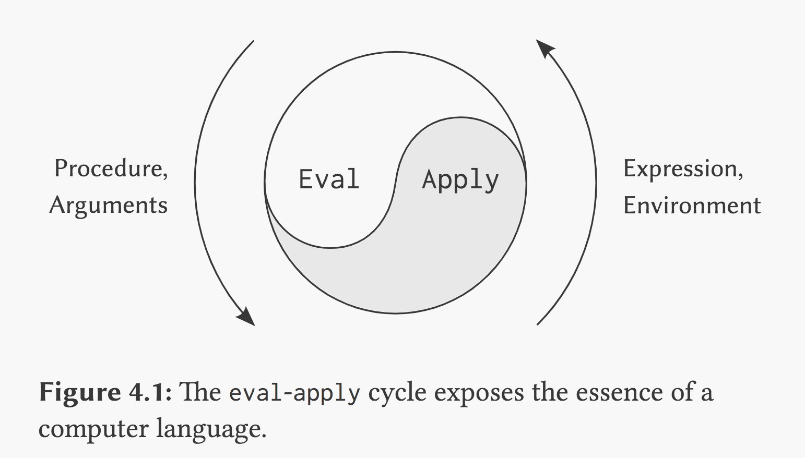
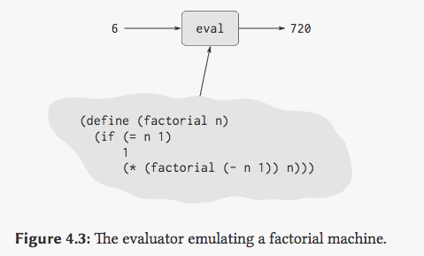

从这一篇文章开始就进入了 SICP 第四章的内容了，在前三章的内容之中我们接触了 `数据抽象`，`过程抽象`，`模块化` 三个，第四章的内容主要就是实现了一个元循环解释器 (meta-circular) 并对其进行不断地改造引申出别的问题。从篇幅内容来看这一章的主要内容反倒是对当时初读的我最为简单的，因为在学过编译原理的相关课程之后，笔者已经尝试使用了自举的方式实现了一些基于 JVM 的编程语言(这里也建议大家在学习理论的同时也要加强知识的运用，否则没有实际的使用过很多知识就不是那么立体)。本章我们对这个 Scheme 求值器的具体实现不会介绍的特别具体，毕竟书上已经把全部代码都贴上去了，这里更想关注一些引申的问题。

在之前的篇幅之中我们讨论了很多和程序设计相关的内容，主要研究的三个内容是：

1. 数据抽象：如何组合程序的基本元素，构造更复杂的结构
2. 过程抽象：如何将复杂的结构抽象出高层组件，提供更高维度的组合型
3. 模块化，通过高抽象层次的组织方法，提高系统的模块性

通过这些手段已经足够我们设计大部分程序了，但是现实世界中遇到的问题可能更为复杂，或者可能类似的问题出现在同一个领域内。这时候我们可能就要在程序之中引入 **DSL**(领域内语言)了。本质上来讲我们引入 DSL 就是通过语言设计，为程序提供一种 **语言层的抽象** ，来进一步提高我们程序的模块化。

## 元语言抽象

这节之中我们会试着用 Scheme 来实现一个 Scheme 的解释器，用一种语言实现其自身的求值器，称为元循环（meta-circular）。这里我们可以复习一下 `3.2` 节之中出现的求值模型，其中的求值流程分成两步：

1. ‰求值组合式（非特殊形式）时
   - 先求值组合式的各子表达式
   - 把运算符子表达式的值作用于运算对象子表达式的值
2. ‰ 把复合过程应用于实参，是在一个新环境里求值过程体
   - 新环境：过程对象（里环境指针指向）的环境加一个新框架
   - 新框架里是过程的形参与对应实参的约束

这两个步骤构成了 Scheme 求值的基本循环，这两个步骤也是能相互调用和递归 (自己递归或相互递归。求值的子表达式可能要应用复合过程，过程体本身通常又是组合式)，逐步规约到：

- 符号 (从 env 里面取值）
- 基本过程（直接调用基本过程的代码）
- 值类型 (primary type 直接取值)

以上的两个步骤可以被抽象为过程 eval 和 apply ，其中 eval 负责表达式的求值，apply 把一个过程对象应用于一组实际参数，这两者相互递归调用，eval 还有自递归。eval 和 apply 就像下图的这个像是太极图一样的图里，两者相互调用相互生成。



### 基础的递归解释器

#### 核心 eval 和 apply

整个 `eval` 和 `apply` 的过程直接看代码实现就可以了，这里可以看到 `eval` 的过程就是接受一个表达式 exp 和一个环境变量 env ，根据表达式类型的不同进行分别处理。

``` scheme
(define (eval exp env)
  (cond ((self-evaluating? exp) exp)                      ; 基本表达式
        ((variable? exp) (lookup-variable-value exp env)) ; 特殊形式
        ((quoted? exp) (text-of-quotation exp))
        ((assignment? exp) (eval-assignment exp env))
        ((definition? exp) (eval-definition exp env))
        ...                                               ; 组合形式
         (else (error "Unknown expression type: EVAL" exp))))
```

根据 exp 分情况来处理的过程，里面大概有三种类型的处理：

1. 基本表达式：包括能够自求值的表达式、变量
2. 各种特殊表达式：if、quote、lambda、cond 里面还会涉及到和 env 操作的部分
3. 过程结构：递归的对各个子表达式进行求值，然后 apply 应用过程

这里用 `cond` 写了一个 `switch` 结构的过程，这对处理的逻辑顺序有很多的要求，比如在一个 cond 的逻辑之中不同的分支的拜访位置不能有问题，不如使用数据分发的方式去设计这个 eval 的结构，还记得我们在第二章设计数据导向的 API 的时候做的事情么？首先是抽象一个 api 的表格：

``` scheme
; 操作／类型 ／过程
(put <op> <type> <item>)
; 操作／类型
(get <op> <type>)
```

然后给数据类型打上 tag 然后在使用前预先 install 对应的 api，这里我们甚至可以把不同类型的相同实现给出相同的名称，方便直接根据 data-type 去调用：

``` scheme
(define (install-rectangular-package)
; internal procedures
    (define (real-part z) (car z))
    (define (imag-part z) (cdr z))
  	; ... 省略其中的过程
    (put 'make-from-real-imag 'rectangular
        (lambda (x y) (tag (make-from-real-imag x y))))
    (put 'make-from-mag-ang 'rectangular
        (lambda (r a) (tag (make-from-mag-ang r a))))
'done)

```

不过暂时我们先不这么做，因为现在明显我们的 `eval` 和 `apply` 的过程是混杂在一起，我们并没有对 expr 进行相应的预处理给每种数据结构打上 tag，这里可以看到 `eval` 和 `apply` 的互生带来了解释器设计和实现上的便利，但是也在具体的效率、代码编写的规范和拓展性上有了一定的问题。

接着来看核心的 `apply` 过程吧，`apply` 的应用过程就简单了很多，把 `dispatch` 放到比较具体的调用环境：

``` scheme
(define (apply procedure arguments)
  (cond ((primitive-procedure? procedure) ; primary procedure
         (apply-primitive-procedure 
          procedure 
          arguments))
        ((compound-procedure? procedure)  ; compound procedure
         (eval-sequence
           (procedure-body procedure)
           (extend-environment
             (procedure-parameters 
              procedure)
             arguments
             (procedure-environment 
              procedure))))
        (else (error "Unknown procedure type: APPLY" procedure))))
```

1. primitive procedure 是 Scheme 里面也会出现的原生过程，这部分在 `apply` 的时候会直接下发给 Scheme 自带的 `apply procedure` ，因此我们在自己定义 `apply` 之前记得先保存下默认的实现。
2. compound-procedure 这个看起来也很简单，就是把各个 procedure 分别 eval 处理过之后又会回到 `apply` 过程之中，一个互生的调用又出现了。

####表达式处理和派生表达式

要是详细的介绍对各种表达式的处理过程未免失与琐碎，这里就只挑选一个有代表性的 `if` 语句来介绍处理过程，`if` 的具体 eval 实现过程如下：

``` scheme
(define (eval-if exp env)
  (if (true? (eval (if-predicate exp) env))
      (eval (if-consequent exp) env)
      (eval (if-alternative exp) env)))
```

这个过程非常的简单，其中的 `if-predicate` , `if-consequent` , `if-alternative` 都很不过是取出整个 `if-expr` 之中的不同部分的：

``` scheme
(define (if? exp) (tagged-list? exp 'if))
(define (if-predicate exp) (cadr exp))
(define (if-consequent exp) (caddr exp))
(define (if-alternative exp)
  (if (not (null? (cdddr exp)))
      (cadddr exp)
      'false))
```

整个 `if` 的流程就这样拆解完了，根据 `predicate` 拆借出来的结果运算流程重新进入了 `eval` 投入了其他表达式类型的求值过程之中。这里使用 `if` 作为例子还有一个因素就是这个 DSL 实现之中的 `cond` 语句没有自己的具体实现逻辑，而是依赖组合的 `if` 实现的，这被称作派生表达式。

``` scheme
(define (cond? exp) 
  (tagged-list? exp 'cond))
(define (cond-clauses exp) (cdr exp))
(define (cond-else-clause? clause)
  (eq? (cond-predicate clause) 'else))
(define (cond-predicate clause) 
  (car clause))
(define (cond-actions clause) 
  (cdr clause))
(define (cond->if exp)
  (expand-clauses (cond-clauses exp)))
(define (expand-clauses clauses)
  (if (null? clauses)
      'false     ; no else clause
      (let ((first (car clauses))
            (rest (cdr clauses)))
        (if (cond-else-clause? first)
            (if (null? rest)
                (sequence->exp 
                 (cond-actions first))
                (error "ELSE clause isn't 
                        last: COND->IF"
                       clauses))
            (make-if (cond-predicate first)
                     (sequence->exp 
                      (cond-actions first))
                     (expand-clauses 
                      rest))))))
```

上面这段代码比较核心的也就是 `cond->if` 相关的函数了，但是也非常的简单就是解析 `cond` 的结构，层层解析然后通过 `make->if` 生成逐级的 `nested-if` 。

#### 解释器环境操作

解释器的运行环境和我们在第一章、第二章里面解释过的运行环境基本上是一个东西，这不过这里面我们要来手动实现这个环境。这里我们把环境理解为绑定参数的表格就好了。这里给出了环境提供的默认的几个 API：

``` scheme
(lookup-variable-value ⟨var⟩ ⟨env⟩)

(extend-environment ⟨variables⟩ ⟨values⟩ ⟨base-env⟩)

(define-variable! ⟨var⟩ ⟨value⟩ ⟨env⟩)

(set-variable-value! ⟨var⟩ ⟨value⟩ ⟨env⟩)
```

1. 其中的 `lookup-variable-value` 负责了在环境之中查找对应的变量，而  `extend-environment` 则是在根据上级环境来拓展新的 env。
2. `define-variable!` 和 `set-variable-value!` 这一对 API 就比较简单了在环境之中定义变量和修改变量。

> Tips 基础递归解释器的 [源码](<https://github.com/lfkdsk/SICP-Magical-Book/blob/master/code/meta-evaluator/evaluator.rkt>)：
>
> 这里给出了基础的递归解释器的实现代码，这里的程序可以直接使用 `racket` 运行，记得要安装 `sicp` 的包。
>
> PS：这里还有一个问题，就是之前提到要提前把 `apply` 方法保存起来，但是如果保存的过程和 `apply` 的定义同时出现在一个文件里，就会被 `racket` 认为是提前使用未定义方法 orz，因此这里我们单独把这个方法单独提出到一个文件里面引用了。

### 以数据作为程序

在上一节 `基础的递归解释器` 之中我们实现了一个用 Scheme 描述的 Scheme 解释器，我们意识到一个元循环解释器本质上也是一个 Scheme procedure 本身，只不过输入的内容变成了 Scheme 程序本身。这也就是本节标题的意味，我们以数据作为求值器的输入，因此我们能够把数据作为程序来使用。

举出一个我们非常熟悉的 `factorial` 过程：

``` scheme
(define (factorial n)
  (if (= n 1)
      1
      (* (factorial (- n 1)) n)))
```

如果我们把这个过程看做一台机器，那我们就获得了一台只能够计算斐波那契数的机器：


如果我们接受了这种设定，那我们就可以以更高维度的眼光来看我们上述的元循环求值器。如果 `factorial` 是一个特定的机器，那本身求值器就可以被认为是一台通用机器 (要素察觉)，其输入不再是一个具体的内容而是另一台机器（程序）的描述，而功能则变成了对这个机器的模拟过程。



这里我们意识到，我们上面的描述 "另一台机器" 并不准确，求值器是 Scheme 的一个 procedure ，因此求值器本身也可以描述自己。这也就是在书中元循环解释器为什么会被描述为编程语言和用户之间的桥梁，因为用户的输入本身成为了程序运行的一部分，现代的大多数语言也大多都实现了应用内的 `eval` 过程。

其实在书中我们曾经提供以数据为程序的思想，当时的方式是把过程当成可传递的元素来处理，而现在我们能够提供更高层次的数据抽象 —— 抽象到语言。

#### 图灵机

我们在上文中提到了求值器本质上是一个 `"通用机器"` ，这种描述方式让人感觉似曾相识。按照我们上文讨论的说法，我们通过 Scheme 本身实现了一个 Scheme 的解释器，忽略时间和空间的角度上来讲一个解释器可以模拟任意的其他解释器。这样原则上可计算的概念向我们揭示了一个有关 `可计算性的` 全新的领域，图灵根据上文的相似思想给出了称为图灵机的计算模型，证明了计算机的可实现。

图灵的基本思想是用机器来模拟人们用纸笔进行[数学](https://zh.wikipedia.org/wiki/%E6%95%B0%E5%AD%A6)运算的过程，他把这样的过程看作下列两种简单的动作：

- 在纸上写上或擦除某个符号；
- 把注意力从纸的一个位置移动到另一个位置；

而在每个阶段，人要决定下一步的动作，依赖于（a）此人当前所关注的纸上某个位置的符号和（b）此人当前思维的状态。


为了模拟人的这种运算过程，图灵构造出一台假想的机器，该机器由以下几个部分组成：

1. 一条无限长的纸带**TAPE**。纸带被划分为一个接一个的小格子，每个格子上包含一个来自有限字母表的符号，字母表中有一个特殊的符号 ${\displaystyle \square } $ 表示空白。纸带上的格子从左到右依次被编号为0, 1, 2, ...，纸带的右端可以无限伸展。

2. 一个读写头**HEAD**。该读写头可以在纸带上左右移动，它能读出当前所指的格子上的符号，并能改变当前格子上的符号。

3. 一套控制规则

   TABLE

   。它根据当前机器所处的状态以及当前读写头所指的格子上的符号来确定读写头下一步的动作，并改变状态寄存器的值，令机器进入一个新的状态，按照以下顺序告知图灵机命令：

   1. 写入（替换）或擦除当前符号；

   2. 移动 **HEAD**， 'L'向左， 'R'向右或者'N'不移动；

   3. 保持当前状态或者转到另一状态

4. 一个**状态寄存器**。它用来保存图灵机当前所处的状态。图灵机的所有可能状态的数目是有限的，并且有一个特殊的状态，称为*停机状态*。

注意这个机器的每一部分都是有限的，但它有一个潜在的无限长的纸带，因此这种机器只是一个理想的设备。图灵认为这样的一台机器就能模拟人类所能进行的任何计算过程。图灵机这样的定义在我们现在看来是显然的，基本上就是一个 `有限状态机`的通俗化描述，但是在计算机还未诞生的当时代表了一种伟大的思想性革命。

结合上文，如果和我们使用的 Scheme 类比，每个 procedure 都能类比为一个特定的图灵机，那我们制作的 Scheme 解释器就可以类比于 `元图灵机(Universal Turing-Machine)` ，元图灵机以其他的图灵机作为输入能够模拟其他图灵机的行为，这也是为何我们说 `通用机器` 的描述不谋而合了。

> Tips: 关于可计算性 (Computability) 
>
> 关于图灵机、可计算性相关的知识笔者也只有概念上的理解。涉及到具体知识的学习笔者在看 [CS121 Introduction to Theoretical Computer Science](https://introtcs.org/public/index.html) 这门入门课和 《Computability》这本书。

#### 停机问题

在上一节图灵机的描述里面我们提到了图灵机有一个特殊的停机问题，通俗地说，停机问题就是判断任意一个程序是否能在有限的时间之内结束运行的问题。该问题等价于如下的判定问题：是否存在一个程序P，对于任意输入的程序w，能够判断w会在有限时间内结束或者死循环。这个题目也出现在了书中的 4.15 题目之中：

> **Exercise 4.15:** Given a one-argument procedure `p` and an object `a`, `p` is said to “halt” on `a` if evaluating the expression `(p a)`returns a value (as opposed to terminating with an error message or running forever). Show that it is impossible to write a procedure `halts?` that correctly determines whether `p` halts on `a` for any procedure `p` and object `a`. Use the following reasoning: If you had such a procedure `halts?`, you could implement the following program:

``` scheme
(define (run-forever)
  (run-forever))

(define (try p)
  (if (halts? p p)
    (run-forever)
    'halted'))
```

这个 `halts` 肯定是找不到的，`try` 的实现本身就是 **交叉** 矛盾的，如果有 `(halts? p p )` 为 `True` 那就会 `run-forever` 持续运行下去，而如果 `(halts? p p)` 为 `False`，那么程序又会 `halted` 。因此我们能非常直观的从程序而非逻辑、数学的角度来发现这个问题。

> Tips 其实图灵发现的这个奇怪的反证方法并不是靠灵光一闪，而是康托尔 [对角线方法](<https://zh.wikipedia.org/wiki/%E5%B0%8D%E8%A7%92%E8%AB%96%E8%AD%89%E6%B3%95>) 的一个实质的应用，读一下 《Gödel, Escher, Bach: An Eternal Golden Braid》 之中的相关章节，能获得更多的情报。

### 内部定义

内部定义这一节里我们主要讨论的问题的主要是关于查找环境引用，我们上面实现的 `eval & apply` 系统之中环境的置入都是按照顺序的，好在我们的 Scheme 求值器的方法定义和实际使用的求值时机不同。例子可以看一下这个互调的方法示例：

``` scheme
(define (f x)
  (define (even? n)
    (if (= n 0)
        true
        (odd? (- n 1))))
  (define (odd? n)
    (if (= n 0)
        false
        (even? (- n 1))))
  ⟨rest of body of f⟩)
```

`even` 的过程被定义的时候 `odd` 的实现还没有被定义，按照我们的定义的语义应该是 `even` 和 `odd` 同时被加入该环境。这在实际之中很难被实现，不过我们也应该能很简单的想出解决办法，可以在原部分放一个名字或者一个假的引用，当对应的 `define` 被填充进去了之后被调用就能正常被 link 到了。书中给出的方法其实也是其中的一种方法：

``` scheme
(lambda ⟨vars⟩
  (define u ⟨e1⟩)
  (define v ⟨e2⟩)
  ⟨e3⟩)

; 转换成
(lambda ⟨vars⟩
  (let ((u '*unassigned*)
        (v '*unassigned*))
    (set! u ⟨e1⟩)
    (set! v ⟨e2⟩)
    ⟨e3⟩))
```

这里是通过自动为每个定义块自动提前添加一个 `let` 的定义项目，然后先设置为预定义状态，然后当对应的项目被定义之后再对其进行重定义。

## 总结

这一节的内容比较的简单，主要是通过对前几章提供的抽象手段，再一次提供一个更为深入的抽象方法 —— 语言抽象。随即我们引入 `eval & apply` 的核心流程、增加解释器的环境操作，完成了基础的 Scheme 元循环解释器。随后又讨论了和程序抽象环境查找的一些 case ，浅尝辄止的引入了和图灵机、停机问题的相关讨论。下一章里面我们会对基础的 Scheme 解释器实现进行修改，增加诸如 JIT、amb 实现等相关内容。

